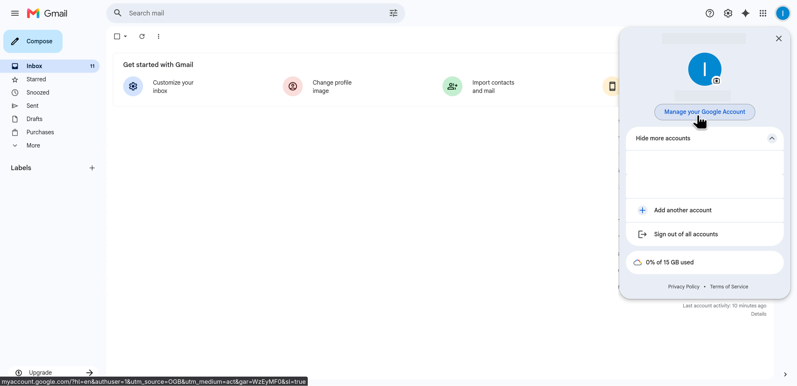
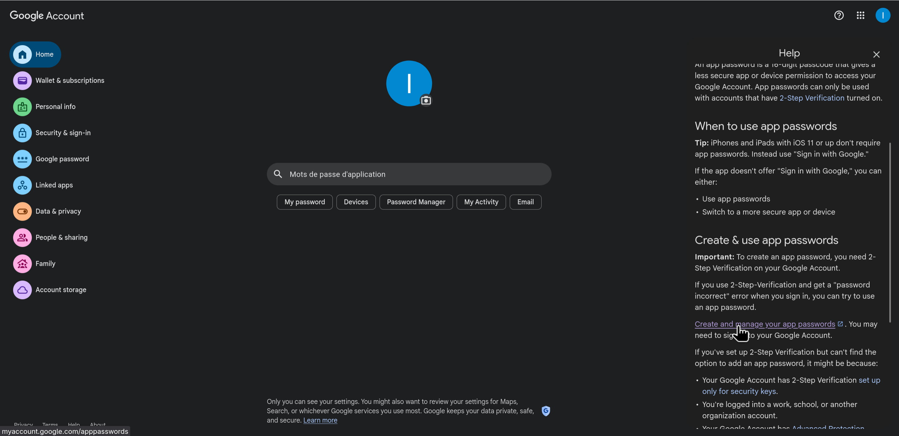
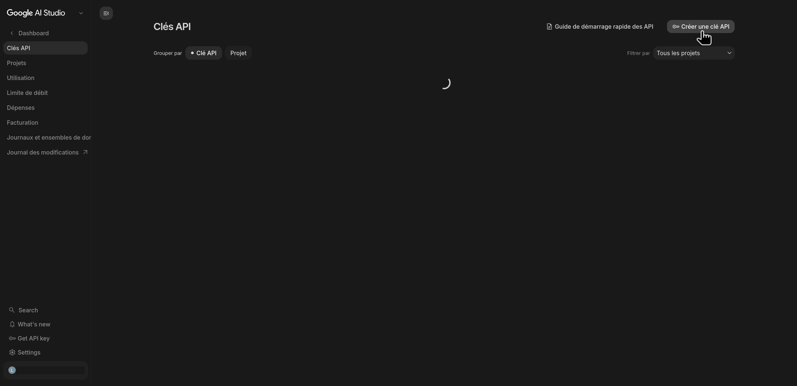
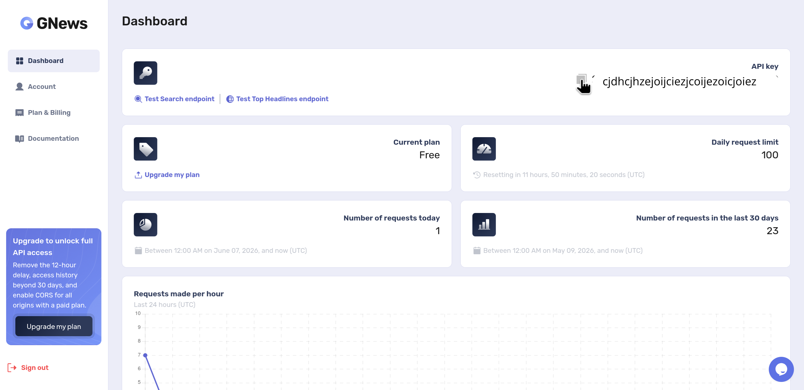
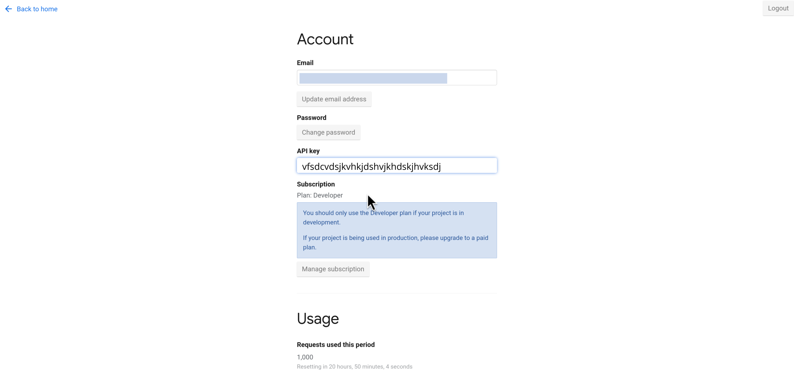

# Comment configurer votre .env

Pour que n8n puisse envoyer des e-mails, lire les actualités et utiliser l'intelligence artificielle, vous devez lui donner ses clés d'accès. Toutes ces informations vont être rangées dans un fichier caché que l'on appelle le .env.

---

### Étape 1 : Créer le fichier sur votre ordinateur

1. Allez dans le dossier de votre projet.
2. Créez un nouveau fichier et nommez-le exactement .env.
3. Ouvrez le fichier .env.example qui est déjà dans le dossier, copiez tout son contenu, et collez-le dans votre nouveau fichier .env.

Maintenant, nous allons remplacer chaque ligne par vos vraies informations.

---

### Étape 2 : Configurer les e-mails (SMTP)

#### SMTP_USER
Écrivez simplement l'adresse Gmail qui servira à envoyer les messages à vos utilisateurs.

#### SMTP_PASSWORD
Attention : Ce n'est PAS le mot de passe habituel de votre compte Gmail ! Pour des raisons de sécurité, Google demande de créer un mot de passe d'application unique. Voici comment faire :

1. Connectez-vous sur votre compte Gmail habituel.
2. Cliquez sur votre photo en haut à droite, puis sur Gérer votre compte Google.
   
   
   
3. Vous arrivez sur le gestionnaire de votre compte.
4. Ddans la barre de recherche, tapez exactement : "Mots de passe d'application" (vérifiez d'avoir l'A2F sur votre compte gmail).
   
   
   
5. Donnez un nom simple à ce mot de passe, par exemple : persona.
6. Cliquez sur Créer. Une petite fenêtre s'ouvre avec un code de 16 lettres. 
7. Copiez ce code et collez-le dans votre fichier .env juste après SMTP_PASSWORD=.

---

### Étape 3 : Configurer l'Intelligence Artificielle

#### GEMINI_API_KEY
C'est la clé qui permet d'utiliser l'agent IA.

1. Rendez-vous sur le site officiel : https://aistudio.google.com/app/api-keys
2. Connectez-vous avec votre compte Google.
   
   
   
3. Cliquez sur le gros bouton Create API key.
4. Copiez le long texte qui s'affiche, et collez-le après GEMINI_API_KEY= .

---

### Étape 4 : Configurer la recherche d'actualités

Pour trouver les meilleurs articles sur internet, nous utilisons plusieurs sources.

#### GNEWS_API_KEY
1. Rendez-vous sur le site : https://gnews.io/
2. Cliquez sur le bouton Get API key.
3. Créez un compte gratuit.
4. Une fois connecté, votre tableau de bord va vous afficher votre clé. Copiez-la et collez-la après GNEWS_API_KEY= dans votre fichier .env.
   
   

#### NEWS_API_KEY
1. Rendez-vous sur le site secondaire : https://newsapi.org/
2. Cliquez sur Get API key et suivez exactement les mêmes étapes que pour GNews.
3. Créez votre compte gratuit, récupérez votre clé, et collez-la après NEWS_API_KEY= dans votre fichier .env.
   
   

---

Bravo ! Votre fichier .env est enfin complet et totalement prêt. Vous pouvez l'enregistrer et le fermer. Votre système possède désormais toutes les clés pour fonctionner de manière autonome.

 [retourner sur la documentation principale](lancement.md)