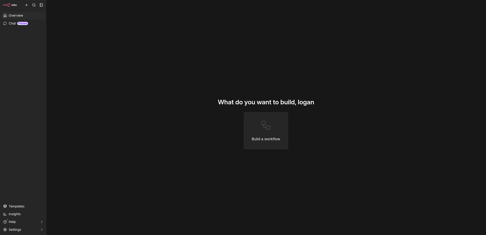
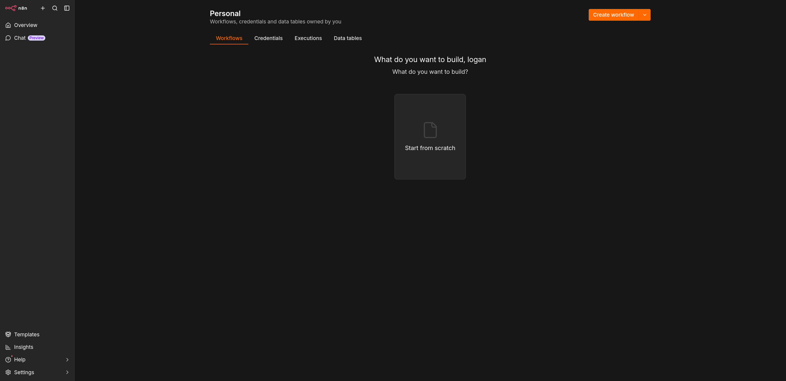

# Documentation d'installation du projet n8n

Bienvenue sur cette documentation qui vous permettra de lancer le projet n8n sans problème.

---

### Étape 1 : Vérification de Docker

Pour commencer, vérifiez que vous avez bien Docker d'installé sur votre ordinateur en tapant cette commande dans votre terminal :

docker --version

Si ce n'est pas le cas, je vous invite à aller voir la documentation officielle d'installation pour Docker : [Documentation d'installation de Docker](https://docs.docker.com/get-docker/).

---

### Étape 2 : Configuration de l'environnement

Avant de lancer Docker, vous devez remplir le fichier `.env` en suivant l'exemple fourni dans le fichier `.env.example`. Ce fichier permettra à n8n d'aller chercher vos clés API ou mots de passe sans pour autant les écrire en dur dans le code, ce qui poserait un vrai problème de sécurité.

Veuillez suivre la documentation dédiée pour cette partie :
 [Configuration du fichier .env](env.md)

---

### Étape 3 : Lancement de n8n

Une fois votre fichier `.env` complet, vous pouvez lancer la commande suivante dans votre terminal pour démarrer le projet :

docker compose up -d

Bravo, votre conteneur Docker est lancé !

---

### Étape 4 : Premier accès à l'interface

Maintenant, vous pouvez ouvrir votre navigateur préféré et vous rendre à l'adresse suivante : **http://localhost:5678**.

Une fois dessus, il vous sera demandé de créer un compte administrateur. Suivez les étapes à l'écran. Vous devriez ensuite arriver sur une page principale qui ressemble à celle-ci :

---

### Étape 5 : Importation de la base de données

Une fois sur cette page, nous allons d'abord commencer par importer notre base de données. Pour cela, cliquez sur **Build workflow** si cela vous est demandé, puis cliquez sur **Personal** dans le menu de gauche.

Vous pouvez maintenant suivre la documentation spécifique pour importer votre base de données :
 [Importer la base de données](Database.md)

---

### Étape 6 : Importation des workflows

La base de données étant en place, il ne vous reste plus qu'à importer les différents scénarios de l'application : [Importer les workflows](workflows.md)

---

### Étape 7 : Récupérer l'URL de votre newsletter

Maintenant que tout est configuré, il ne vous manque plus que l'URL sur laquelle vous et vos utilisateurs allez pouvoir accéder à la newsletter.

1. Retournez sur le workflow **auth_persona**.
2. Cliquez sur le tout premier nœud du scénario nommé **welcome**.

   *[Insérer ici : Image du noeud welcome]*

3. Dans la configuration du nœud, tout en haut, passez l'affichage sur **Production URL**.
4. Cliquez sur l'URL pour la copier.

Il ne vous reste plus qu'à la coller dans votre navigateur pour accéder et tester votre nouvelle newsletter !