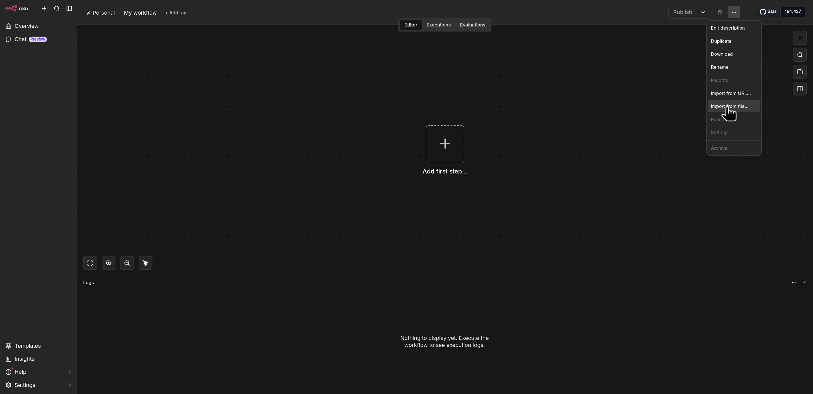
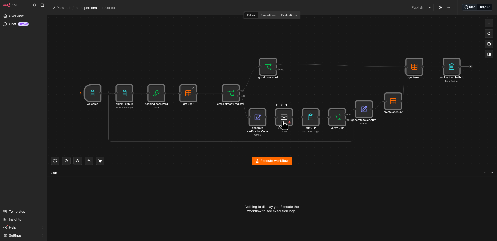
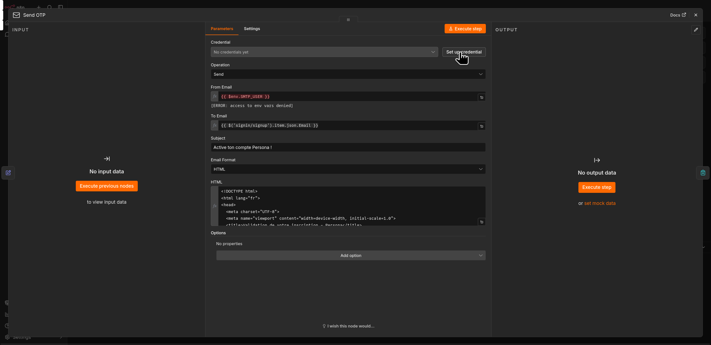
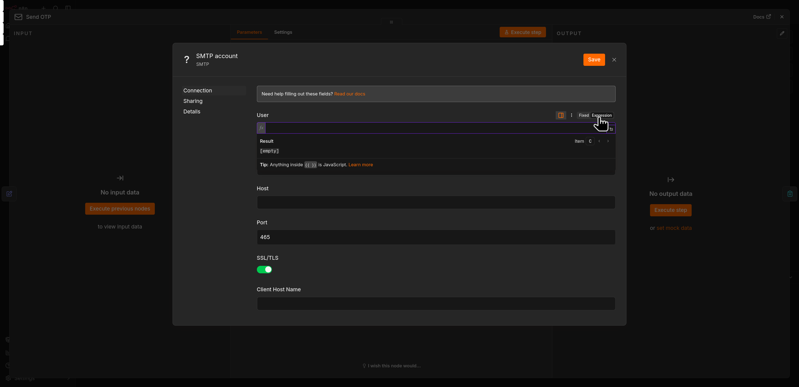
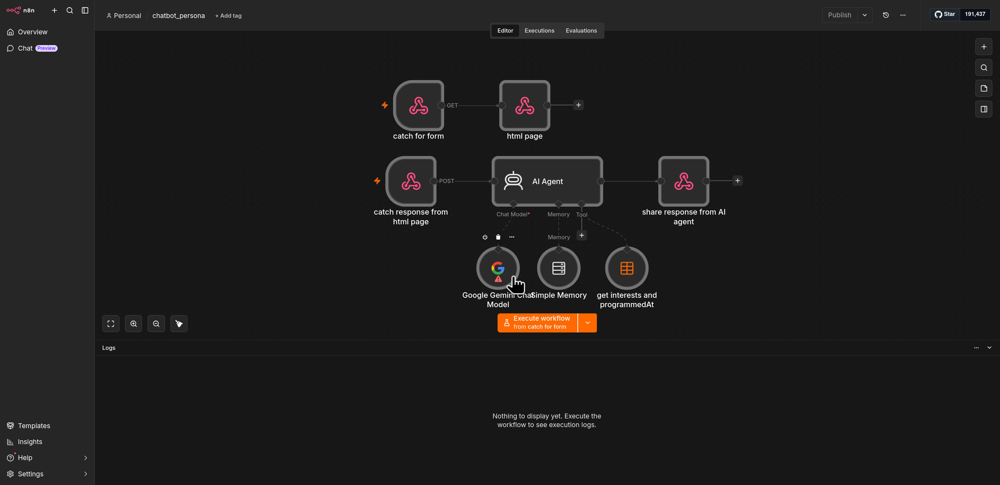

# Comment importer vos workflows

Pour importer vos workflows, vous pouvez cliquer sur le bouton en haut à droite **Create workflow**, puis vous rendre sur les trois petits points en haut à droite et cliquer sur **Import from file**.

   

---

## 1. auth_persona

Rendez-vous dans votre dossier `projet/workflows` et importez le fichier **`auth_persona.json`**.

Une fois le workflow affiché, vous devez simplement mettre en place les identifiants de messagerie (credentials) et publier le workflow. Pour cela, double-cliquez sur le nœud **Send OTP**.

   

Rendez-vous ensuite sur **Setup credentials** et remplissez les champs avec les informations suivantes :

   

* **User** : `{{ $env.SMTP_USER }}`
* **Password** : `{{ $env.SMTP_PASSWORD }}`
* **Host** : `smtp.gmail.com`

> **Attention :** N'oubliez pas de passer en mode **Expression** (en cliquant sur le petit bouton expression à coté de fixed) lorsque vous remplissez les champs *User* et *Password*.
>
> 

Vous pouvez sauvegarder. Il ne vous reste plus qu'à publier le workflow grâce au bouton **Publish** en haut à droite.

*Note : Si vous ne pouvez pas publier, vérifiez les nœuds. Si vous voyez un symbole "attention" en rouge, vous avez juste à double-cliquer sur le nœud concerné puis à le refermer pour l'actualiser.*

Une fois cela fait, vous pouvez à nouveau cliquer sur **Personal** dans le menu de gauche pour revenir au menu principal et importer les autres workflows.

---

## 2. chatbot_persona

Rendez-vous dans votre dossier `projet/workflows` et importez le fichier **`chatbot_persona.json`**.

Une fois ici, vous devez simplement mettre en place les identifiants du modèle d'intelligence artificielle et publier le workflow. Pour cela, double-cliquez sur le nœud **Gemini**.

   

Rendez-vous ensuite sur **Setup credentials** et remplissez le champ avec l'information suivante :

* **API KEY** : `{{ $env.GEMINI_API_KEY }}`

> ⚠️ **Attention :** N'oubliez pas de passer en mode **Expression** (en cliquant sur le petit bouton *fx*) lorsque vous remplissez le champ *API Key*.

Vous pouvez sauvegarder. Il ne vous reste plus qu'à publier le workflow grâce au bouton **Publish** en haut à droite.

Une fois cela fait, vous pouvez à nouveau cliquer sur **Personal** pour revenir au menu et continuer les importations.

---

## 3. send_mail

Rendez-vous dans votre dossier `projet/workflows` et importez le fichier **`send_mail.json`**.

Pour ce workflow, vous avez juste à double-cliquer sur les nœuds **Send news** et **Gemini** (ils ont un symbole rouge) pour les actualiser, puis à les refermer.

Il ne vous reste plus qu'à publier le workflow grâce au bouton **Publish** en haut à droite.

Une fois cela fait, vous pouvez à nouveau cliquer sur **Personal** pour revenir au menu.

---

## 4. unsubscribe

Rendez-vous dans votre dossier `projet/workflows` et importez le fichier **`unsubscribe.json`**.

Pour celui-ci, vous avez juste à cliquer directement sur le bouton **Publish** en haut à droite.

---

Bravo ! Vous avez importé tous vos workflows. Vous pouvez à nouveau cliquer sur **Personal** pour revenir à votre tableau de bord principal.

 [retourner sur la documentation principale](lancement.md)