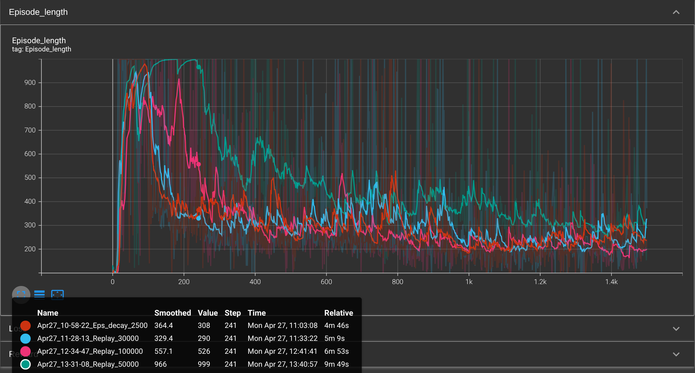
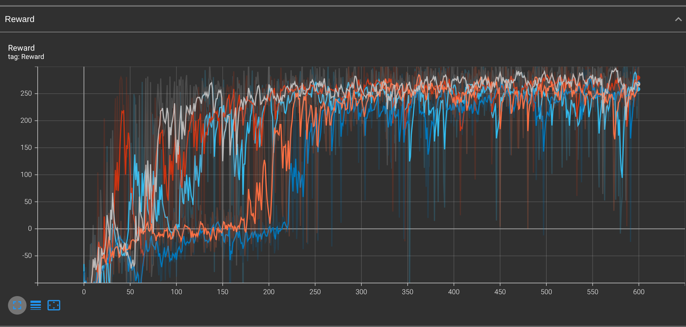
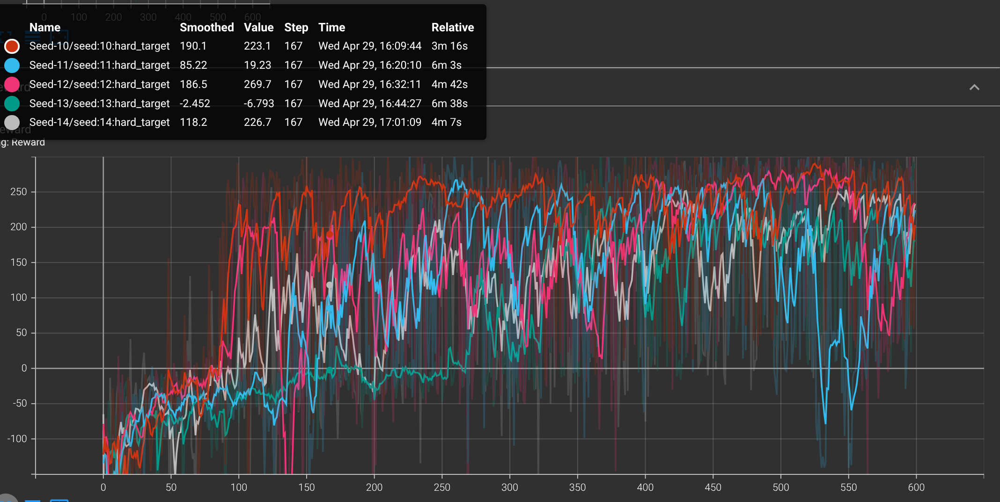
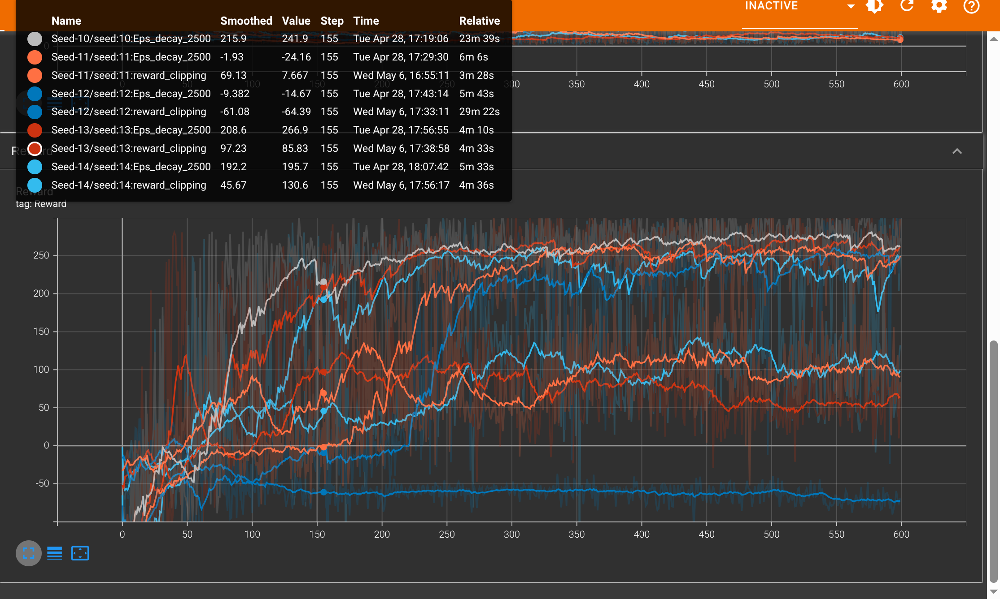
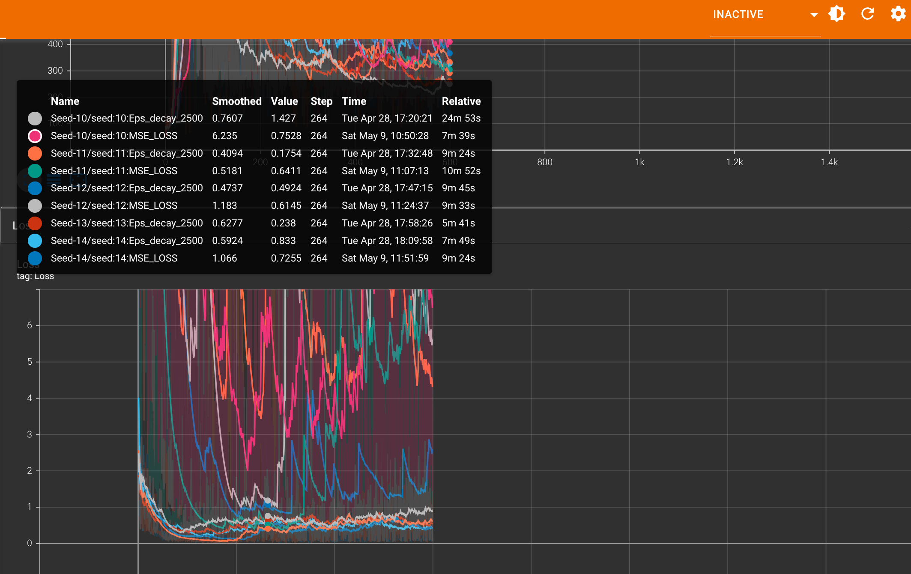
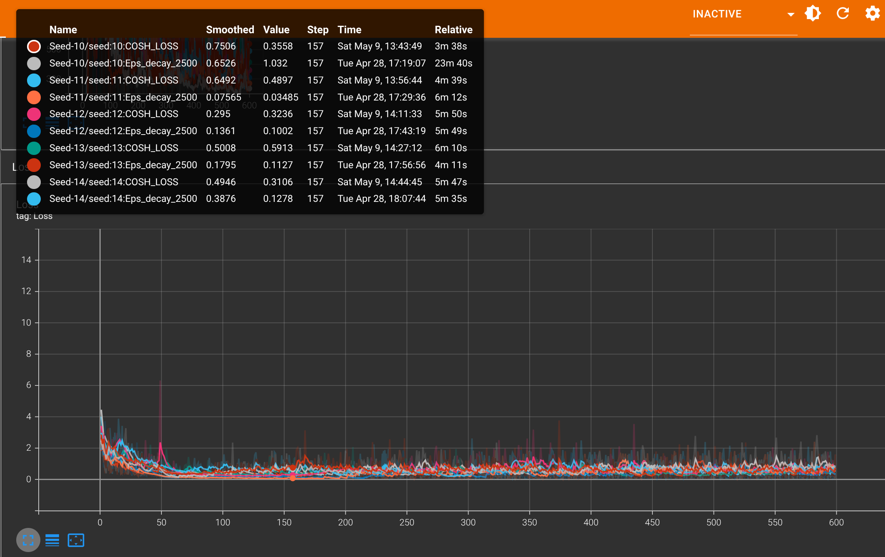
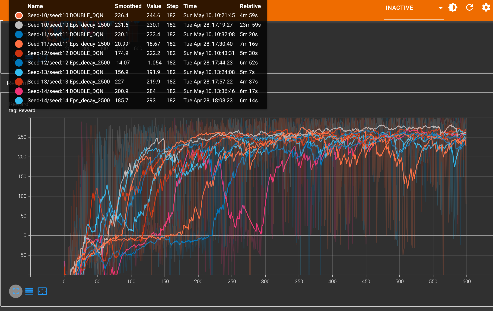
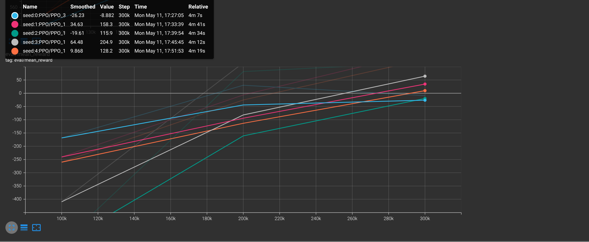
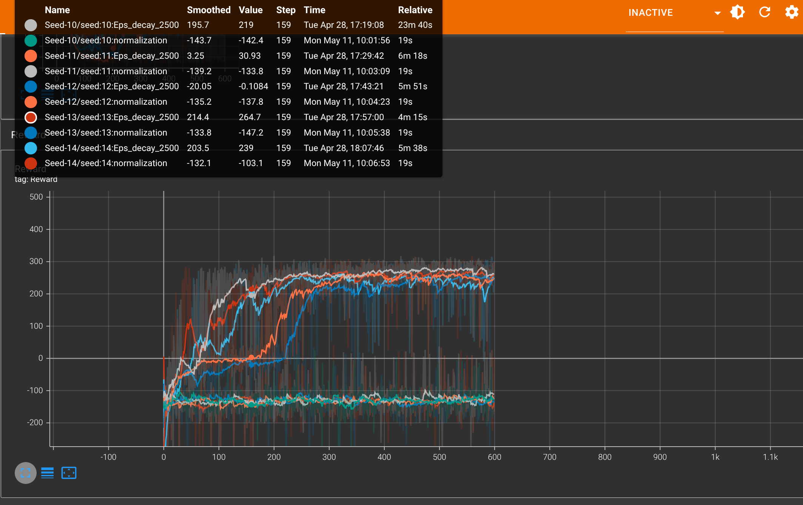

# Project Test

This file contains the tests of our project over time.

---

# **DQN**

## 26/04/2026

### **Explanation**:

The tests focused on epsilon decay, the balance between exploration and exploitation for our DQN agent. We will therefore compare these data points:
  EPS_START: 1.0
  EPS_END: 0.01
  EPS_DECAY: 1000
With these:
  EPS_START: 1.0
  EPS_END: 0.01
  EPS_DECAY: 2500
And:
  EPS_START: 1.0
  EPS_END: 0.01
  EPS_DECAY: 3500
Our goal is to compare 1500 episodes in order to have a solid database.

### **Image**:

### **Result**:

The results show that the orange curve corresponds to an ε_decay of 1000, the red to 2500, and the blue to 3500. From the graph, we can see that the value of 2500 offers the best overall performance. It appears to provide a good compromise between exploration and exploitation, allowing the agent to learn effectively without converging too quickly toward a suboptimal policy.

We also observe that all the curves show a significant drop around the 1000 point. This phenomenon can be interpreted as a form of instability in learning, often associated with the agent partially forgetting the knowledge it acquired during training.

## 27/04/2026

### **Explanation**

Today's tests focused on the ReplayMemory and its capacity:
memory = ReplayMemory(10000)
This is the default value we had defined, but what would the results be for values ​​such as:
- 10000
- 30000
- 50000
- 100000? 
In other words, we wanted to increase our model's capacity to record actions.
For this test, we'll use a value of 1500 episodes.

### **Images**:

#### Les global result:

.png)

#### Best result:

.png)

#### Time length by episode:

### **Result**:

## 28/04/2006

### **Explanation**:

Next, we decided to test our algorithm on 5 random seeds to verify that it wasn't purely lucky or random. This reinforced our idea for Eps_decay and provided us with more extensive data for comparison.

### **Image**:

## 29/04/2026

### **Explanation**:

After establishing the seeds to ensure the reproducibility of the experiments, we compared two methods for updating the target network within the Deep Q-Network framework: soft update and hard update.

In a DQN, two networks are used:

the policy network (training network)
the target network (target)

Soft update incrementally updates the target network.
Hard update consists of copying all the weights from the policy network to the target network every N iterations.

### **Image**:

### SOFT UPDATE

### HARD UPDATE

### **Result**:

The curves reveal that:

Soft updates produce more stable and gradual learning.
Hard updates exhibit more abrupt variations and instability.

Hard updates are often less stable because they introduce significant discontinuities in the training targets, disrupting model convergence.

Conversely, soft updates act as a low-pass filter thus improving the stability and robustness of the learning process.

## 06/05/2006

### **Explanation**:

After establishing a good algorithm with DQN and fairly stable data, we wondered if we could make it even more stable with reward clipping.

This means setting specific reward values ​​to improve our lander.
We decided to set these values ​​between -1 and 1 to see if this would yield good results.

### **Image**:

### **Result**:

The results speak for themselves. With a logical comparison, the reward clipping curves are significantly worse than the baseline one. This can be explained by the fact that:
Rewards aren't just used to indicate good or bad, but to quantify how good or bad an action is:

With clipping (−1, 0, +1), all these nuances disappear:

- a slight improvement and a perfect landing become equivalent
- a small error and a violent crash are treated the same

It is therefore quite logical that, by reducing the importance of the reward values, our result is much worse.

## 09/05/2026

### **Explanation**:

Next, we focused on the loss function, which is a central element of the learning process in our DQN algorithm. Its role is to measure the difference between the value predicted by the neural network for a given action and the target value estimated using Bellman's equation. This error allows us to adjust the network's weights to progressively improve the evaluation of actions. In the case of LunarLander-v3, this mechanism is particularly important because the agent must assign a different value to each possible action (starting an engine, correcting the orientation, doing nothing, etc.) in order to learn how to land correctly. 

It is found in the Agent.py file and the optimize_agent function.

Thus, our test will focus on switching from the current Huber method to MSE Loss (Mean Squared Error).

But also the Log cash loss in order to have a wider range of actions covered

### **Image**:

#### HUBBER VS MSE

#### HUBBER VS COSH

### **Result**:

After comparing several loss functions, we observed that the Mean Squared Error (MSE) is not suitable for the Lunar Lander problem, primarily due to its high sensitivity to outliers, which leads to instability in the learning process.

Conversely, the Log-Cosh Loss proved to be a pleasant surprise, demonstrating very good performance. Its smooth shape and robustness to large errors allow for more stable and efficient convergence in this context.

However, we chose to retain the Huber Loss because it offers a better practical compromise: it is easily configurable thanks to its threshold parameter, and, more importantly, it is widely used and well-documented in reinforcement learning approaches applied to the Lunar Lander. This standardization facilitates the reproducibility and interpretation of results.

## 10/05/2026

### **Explanation**:

After studying several reinforcement learning approaches, we initially focused our work on a Simple DQN architecture due to its ease of implementation and good preliminary performance on LunarLander-v3.

However, to strengthen our experimental approach and validate the relevance of this choice, we decided to also evaluate other benchmark methods in Deep Reinforcement Learning, including Double DQN and Proximal Policy Optimization (PPO).

### **Image**:

#### DOUBLE DQN:

#### PPO:

### **Result**:

We can now justify our choice of DQN, which appears to be the most suitable algorithm for our LunarLander-v3 case study. The results obtained show faster and more stable rewards during training. DQN achieves good performance earlier and exhibits more consistent convergence across different executions, making it an effective solution for quickly obtaining a reliable agent.

This behavior is explained in particular by the nature of the LunarLander-v3 environment, which has a discrete action space. Value-based methods, such as DQN, are particularly effective in this type of problem because they learn directly to estimate the best action to perform in each state. Conversely, approaches like PPO are often better suited to continuous action spaces or more complex environments.

Regarding Double DQN, the results remain satisfactory, but learning occurs later. While this variant generally reduces the overestimation of Q-values ​​and improves theoretical stability, it requires more iterations to achieve high performance. In our case, the main objective is to obtain a high-performing and reliable model as quickly as possible. Classical DQN therefore better meets this constraint, although the choice of algorithm always depends on the context, available resources, and desired objectives.

## 11/05/2026

### **Explanation**:

On this Monday, May 11th, we decided to test the normalization of values ​​to reinforce learning. This could prove useful in reducing the gap in values ​​and thus improving the stability of learning.

### **Image**:

### **Result**:

By comparing the top and bottom curves, we can clearly see that normalization ultimately makes the data catastrophic in terms of its values. This is undoubtedly because the values ​​it attempts to normalize cause them to become toxic. We therefore conclude that data normalization is not a good method.

