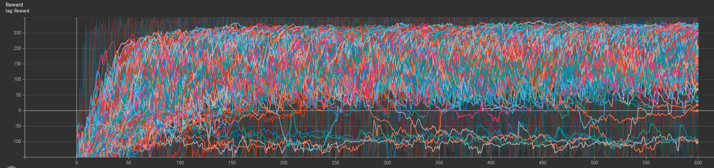
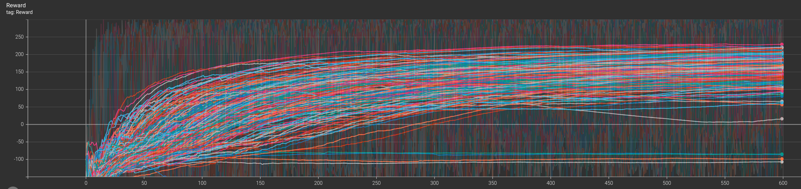
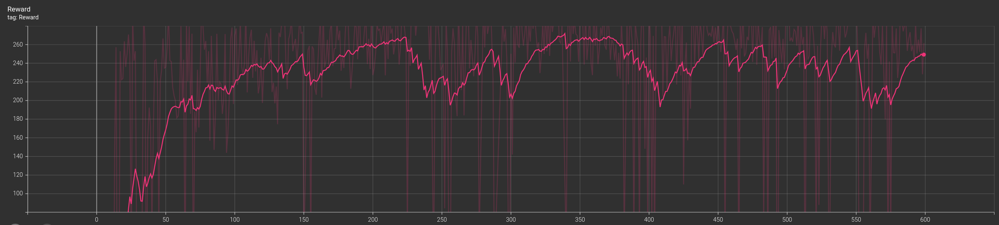

# Hyperparameter Optimization: Grid Search Analysis

To maximize the performance of our agent, we implemented a **Grid Search** strategy. This methodical approach allowed us to explore an extensive range of hyperparameter combinations, testing each configuration systematically to identify the most robust model.

### 1. Raw Results Visualization
After exhaustive training sessions, the initial results displayed significant variance. As shown in the raw data below, the sheer volume of overlapping experiments makes direct interpretation challenging due to the inherent noise in Reinforcement Learning rewards.

*Figure 1: Raw cumulative rewards for all grid search iterations.*

### 2. Data Smoothing for Trend Analysis
To better discern the learning trajectories and stability of each configuration, we applied **exponential smoothing**. This technique filters out high-frequency noise, allowing us to focus on the long-term convergence of the agents.

*Figure 2: Smoothed reward curves highlighting convergence trends.*

### 3. Identification of the Optimal Configuration
Through this analysis, one specific candidate clearly outperformed the rest, achieving the highest asymptotic reward and demonstrating superior learning efficiency.

*Figure 3: Best performing hyperparameter set identified by the Grid Search.*

By analyzing the run identifier `grid_LR0.001_G0.99_B64_D1000_START1.0_END0.1TAU0.01`, we extracted the optimal hyperparameters for our final model:

| Hyperparameter | Value | Description |
| :--- | :--- | :--- |
| **Learning Rate (LR)** | `1e-3` | Step size for weight updates. |
| **Gamma ($\gamma$)** | `0.99` | Discount factor for future rewards. |
| **Batch Size** | `64` | Number of samples per training iteration. |
| **Epsilon Decay** | `1000` | Rate at which exploration decreases. |
| **Epsilon Start** | `1.0` | Initial exploration probability. |
| **Epsilon End** | `0.1` | Minimum exploration threshold. |
| **Tau ($\tau$)** | `0.01` | Target network soft-update coefficient. |

### Efficiency and Resource Optimization

Identifying these optimal hyperparameters does more than just improve the agent's performance; it significantly reduces the **computational overhead**. By pinpointing the configuration that converges the fastest, we minimize the number of training episodes required to reach a stable solution. 

This efficiency directly translates to:
* **Reduced Training Time:** Faster iterations during the development cycle.
* **Lower Computational Cost:** Less GPU/CPU hours consumed.
* **Sustainability:** A smaller carbon footprint by avoiding redundant or inefficient training runs.

In conclusion, this Grid Search was a critical investment that ensured our final model is not only high-performing but also resource-efficient.