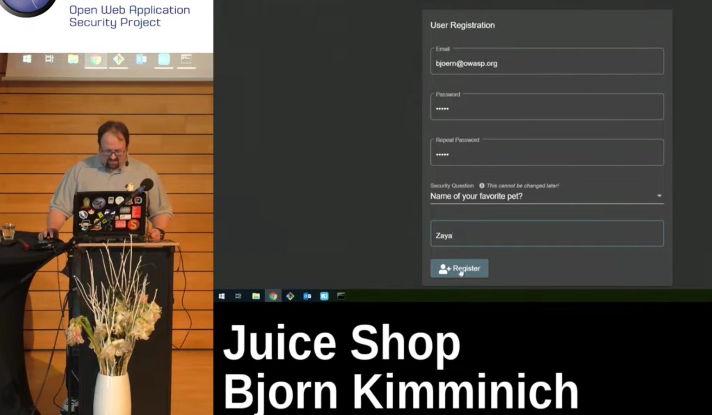

# Rapport de Vulnérabilité

## Vulnérabilité

| Champ                      | Détails                                             |
|----------------------------|-----------------------------------------------------|
| **Type**                   | OSINT (Open Source Intelligence) |
| **Composant affecté** | Système de récupération de compte (Question de sécurité) |
| **Sévérité** | 🟠 Élevée   |

---

## Méthodologie

### Techniques utilisées
- [x] OSINT
- [x] Autre : Visionnage de vidéo publique (YouTube)

### Outils utilisés
| Outil        | Objectif                                                |
|--------------|---------------------------------------------------------|
| Navigateur   | Navigation sur l'interface `/administration` & Recherches internet sur `Björn Kimminich` |
| YouTube      | Réponse en dure via une démonstration dans une vidéo |

### Étapes

1. **Identification de la cible** — Tentative de réinitialisation du mot de passe de l'utilisateur `bjoern@owasp.op`. La question posée est : *"Name of your favorite pet?"*.
2. **Recherche OSINT** — Recherche du nom "Bjoern Kimminich" sur un navigateur qui vient confirmer son rôle de créateur de l'OWASP Juice Shop.
3. **Exploitation de média public** — Vidéo YouTube où l'auteur effectue une démonstration technique du site et créer un compte.
4. **Récupération du secret** — L'auteur saisi la réponse à la question secrète directement dans la vidéo.

---

### Preuve de concept

**Cible :** `bjoern@owasp.org` 
**Question :** *Name of your favorite pet?* 
**Réponse :** `Zaya`

**Réponse à la question de sécurité :** 

## Risques

### Impact
- **Account Takeover**.
- **Accès aux informations personnelles**.
- **Usurpation d'identité** sur la plateforme.

---

## Correction

### Correctifs

- **Action 1 : Supprimer les questions de sécurité** : Ce mécanisme est obsolète et vulnérable à l'OSINT.
- **Action 2 : Désactiver le compte compromis** : Réinitialiser immédiatement les accès de l'utilisateur concerné.
- **Action 3 : Nettoyage numérique** : Supprimer ou éditer la vidéo YouTube pour masquer les informations sensibles.

### Bonnes pratiques de sécurité recommandées

- **Implémenter le MFA (Multi-Factor Authentication)** : Utiliser des seconds facteurs robustes (TOTP, FIDO2) au lieu de secrets basés sur la vie privée.
- **Sensibilisation à l'OPSEC** : Former les équipes à ne jamais filmer de secrets ou de données personnelles lors de démonstrations produits.
- **Masquage des données** : Ne pas afficher les e-mails complets ou les infos sensibles sur les tableaux de bord publics.