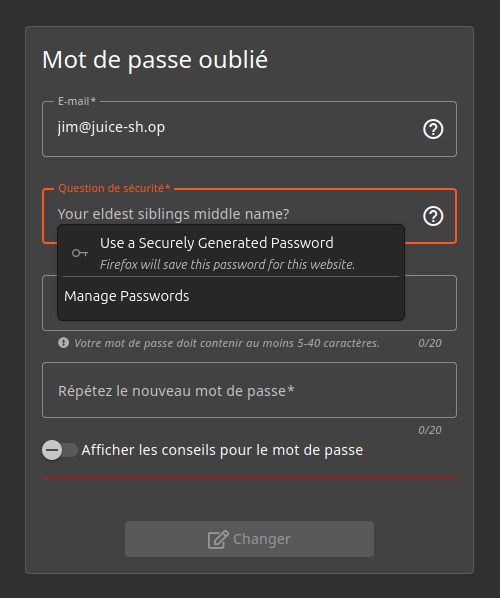
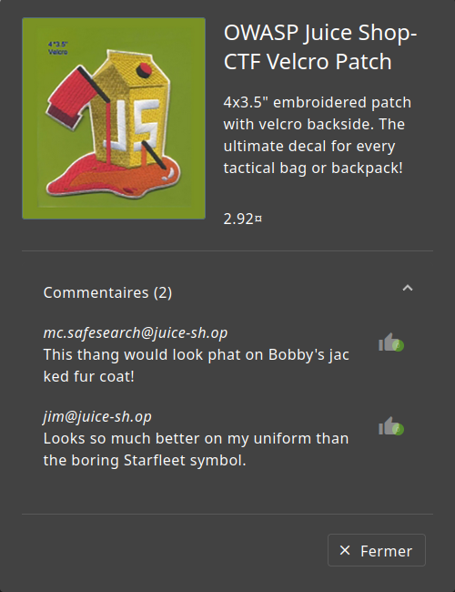
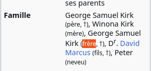

# Rapport de Vulnérabilité

## Vulnérabilité

| Champ                      | Détails                                             |
|----------------------------|-----------------------------------------------------|
| **Type**                   | OSINT (Open Source Intelligence) |
| **Composant affecté** | Système de récupération de compte (Question de sécurité) |
| **Sévérité** | 🟠 Élevée   |

---

## Méthodologie

### Techniques utilisées
- [x] OSINT
- [x] Autre : Recherches internets (Wikipédia)

### Outils utilisés
| Outil          | Objectif                                             |
|----------------|------------------------------------------------------|
| Navigateur     | Recherche sur la thématique "Starfleet / Star Trek"  |
| Wikipédia      | Identification des membres de la famille du personnage |

### Étapes

1. **Identification de la cible** — Tentative de réinitialisation du mot de passe de l'utilisateur `jim@juice-sh.op`. La question posée est : *"Your eldest siblings middle name?"*.
2. **Collecte d'indices** — Analyse des avis/commentaires laissés par l'utilisateur sur le site. Un commentaire mentionne explicitement "Starfleet".
3. **OSINT** — Corrélation entre le prénom "Jim" et "Starfleet". Identification du personnage de fiction James Tiberius Kirk de Star Trek.
4. **Récupération du secret** — Recherches sur la famille du personnage James Tiberius Kirk, son frère aîné s'appelle George Samuel Kirk. Le "middle name" est donc `Samuel`.

---

### Preuve de concept

**Cible :** `jim@juice-sh.op`  
**Question :** *Your eldest siblings middle name?*  
**Réponse  :** `Samuel`

**Question de sécurité de Jim :** 

**Confirmation de sa proximité avec Starfleet :** 

**Réponse à la question de sécurité :** 

## Risques

### Impact
- **Account Takeover**.
- **Accès aux informations personnelles**.
- **Usurpation d'identité** sur la plateforme.

---

## Correction

### Correctifs

- **Action 1 : Supprimer les questions de sécurité** : Ce mécanisme est obsolète et vulnérable à l'OSINT.
- **Action 2 : Désactiver le compte compromis** : Réinitialiser immédiatement les accès de l'utilisateur concerné afin qu'il change ses informations.

### Bonnes pratiques de sécurité recommandées

- **Implémenter le MFA (Multi-Factor Authentication)** : Utiliser des seconds facteurs robustes (TOTP, FIDO2) au lieu de secrets basés sur la vie privée.
- Envoyer un jeton de réinitialisation unique par e-mail au lieu de poser une question.
- **Masquage des données en admin** : Ne pas afficher les e-mails complets ou les infos sensibles sur les tableaux de bord publics.