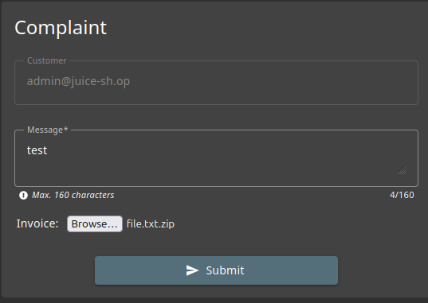
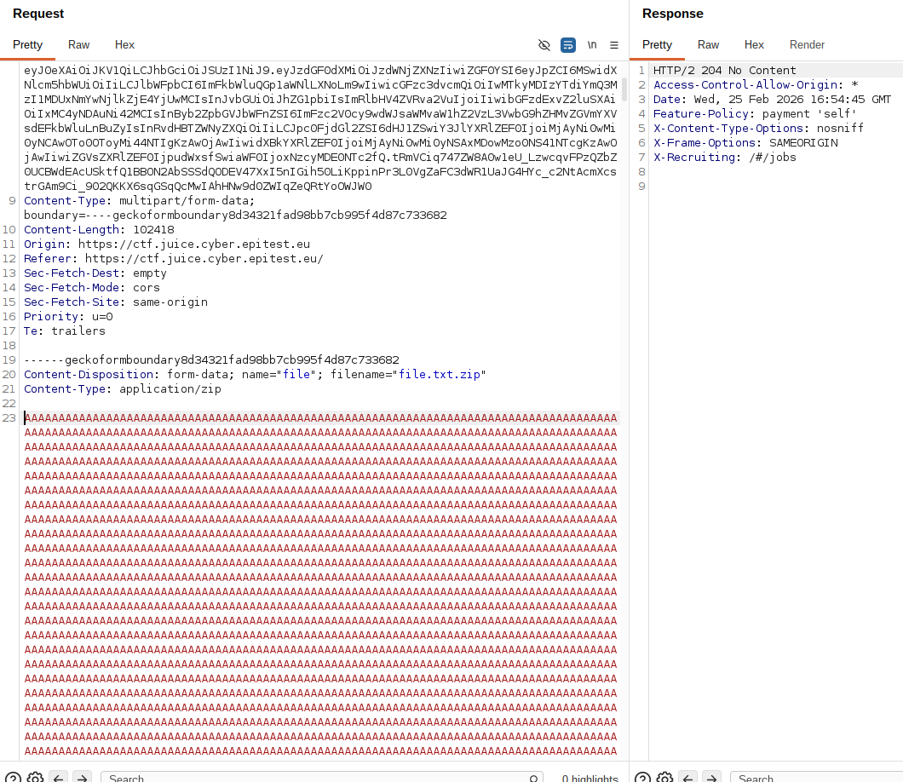

# Rapport de Vulnérabilité

## Vulnérabilité

| Champ                      | Détails                                             |
|----------------------------|-----------------------------------------------------|
| **Type** | Mauvaise configuration / Denial of Service (DoS)    |
| **Composant affecté** | Formulaire de plaintes (Complaints) |
| **Sévérité** | 🟡 Moyenne                                          |

---

## Méthodologie

### Techniques utilisées
- [x] Tests manuels
- [x] Autre : Tampering

### Outils utilisés
| Outil        | Objectif                              |
|--------------|---------------------------------------|
| Navigateur   | Accès à la page `/complaints`         |
| Burp Suite   | Interception et modification d'une requête HTTP |

### Étapes

1. **Envoi d'un premier fichier valide** — Accès à la section "Complaints" où l'on sélectionne d'un fichier légitime (.zip ou .pdf).
2. **Interception** — Capture de la requête POST via l'onglet Proxy de Burp Suite.
3. **Modification du Payload** — Injection d'une grande quantité de caractères (ex: 'A' répétitifs) dans le corps du fichier pour dépasser la limite de 100 KB imposée par le front-end du site.
4. **Exploitation de la mauvaise configuration** — Envoi de la requête modifiée, le fichier est accepté par le serveur malgré sa taille excessive.

---

### Preuve de concept

**Onglet "Complaints" du site :** 
 
**Requête interceptée et modifiée :** 

## Risques

### Impact
- **DoS (Denial of Service)** : Saturation de l'espace disque du serveur si de nombreux fichiers volumineux sont envoyés.
- **Consommation de ressources** : Ralentissement du serveur lors du traitement/stockage de fichiers inutilement lourds.
- **Coûts de stockage** : Augmentation des besoins en stockage cloud/serveur.

---

## Correction

### Correctifs

- **Action 1 : Validation côté serveur** : Ne jamais faire confiance au client. Le serveur doit rejeter immédiatement toute requête dépassant 100 KB avant même de commencer à lire le fichier complet.
- **Action 2 : Configuration du serveur web** : Limiter la taille maximale des requêtes.

### Bonnes pratiques de sécurité recommandées

- Mettre en place des quotas d'upload par utilisateur pour éviter les abus.
- Analyser les types de fichiers côté serveur pour s'assurer que le contenu correspond à l'extension.
- Utiliser des bibliothèques de gestion d'upload sécurisées qui gèrent les limites de flux.