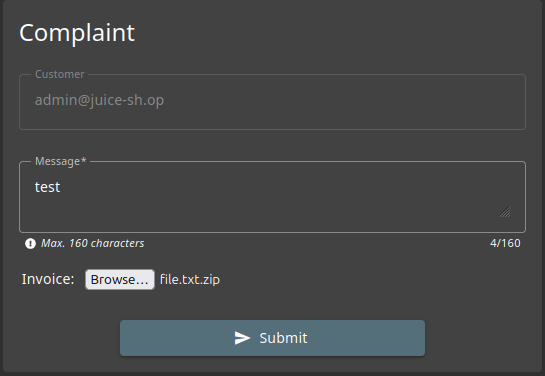
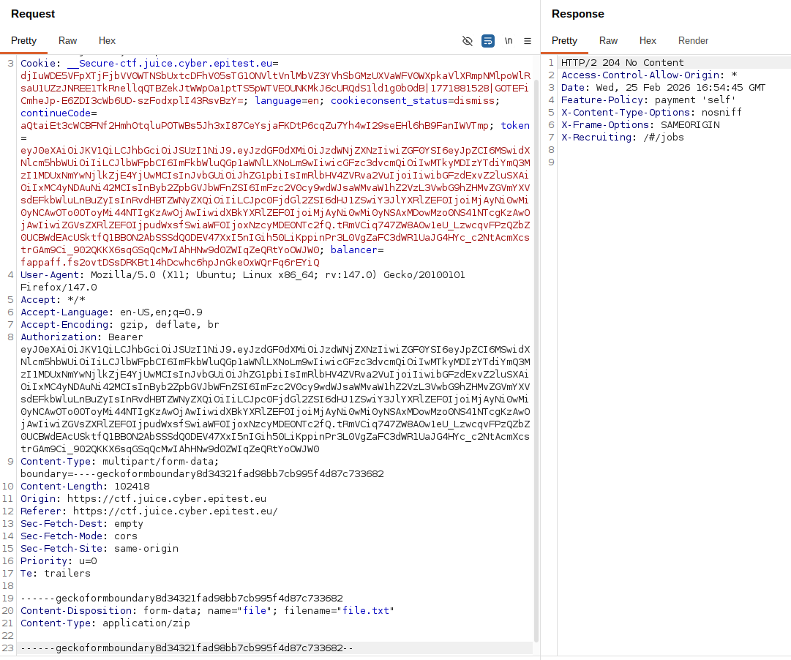

# Rapport de Vulnérabilité

## Vulnérabilité

| Champ                      | Détails                                             |
|----------------------------|-----------------------------------------------------|
| **Type** | Upload de fichier non restreint |
| **Composant affecté** | Formulaire de plaintes (Complaints) |
| **Sévérité** | 🟡 Moyenne                                          |

---

## Méthodologie

### Techniques utilisées
- [x] Tests manuels
- [x] Autre : Manipulation de l'extension de fichier

### Outils utilisés
| Outil        | Objectif                              |
|--------------|---------------------------------------|
| Navigateur   | Accès à la page `/complaints`           |
| Burp Suite   | Interception d'une requête HTTP et modification de l'extension du fichier |

### Étapes

1. **Envoi d'un premier fichier valide** — Accès à la section "Complaints" où l'on sélectionne d'un fichier légitime (.zip ou .pdf).
2. **Interception** — Capture de la requête POST via l'onglet Proxy de Burp Suite.
3. **Modification de l'extension du fichier** — Changement de la valeur du paramètre `filename` dans la requête pour mettre une extension de fichier non supportée.
4. **Exploitation de la mauvaise configuration** — Envoi de la requête modifiée, le fichier est accepté par le serveur malgré sa mauvaise extension.

---

### Preuve de concept

**Requête interceptée et modifiée pour retirer l'extension :**

**Onglet "Complaints" du site :** 
 
**Requête interceptée et modifiée :** 

## Risques

### Impact
- **RCE (Remote Code Execution)** : Si un attaquant parvient à uploader un fichier avec une extension non supportée, il peut alors uploader un script malveillant et réussir à l'exécuter sur le serveur.
- **Stockage de fichiers malveillants** : Utilisation du serveur comme hôte pour des malwares ou des fichiers illégaux.
- **DoS (Denial of Service)** : Possibilité d'envoyer des types de fichiers qui provoquent des erreurs lors du traitement automatisé par le serveur.

---

## Correction

### Correctifs

- **Action 1 : Validation stricte côté serveur** : Vérifier l'extension du fichier et le "Content-Type" directement sur le back-end.
- **Action 2 : Vérification du "Magic Number"** : Analyser les premiers octets du fichier pour confirmer sa nature réelle (ex: un PDF doit commencer par `%PDF-`) au lieu de se fier uniquement à l'extension.
- **Action 3 : Renommage automatique** : Renommer systématiquement les fichiers uploadés avec un identifiant unique et une extension sûre générée par le serveur.

### Bonnes pratiques de sécurité recommandées

- Stocker les fichiers uploadés en dehors de la racine Web (Document Root).
- Désactiver les droits d'exécution sur le répertoire de stockage des fichiers.
- Utiliser une whitelist d'extensions autorisées plutôt qu'une blacklist.