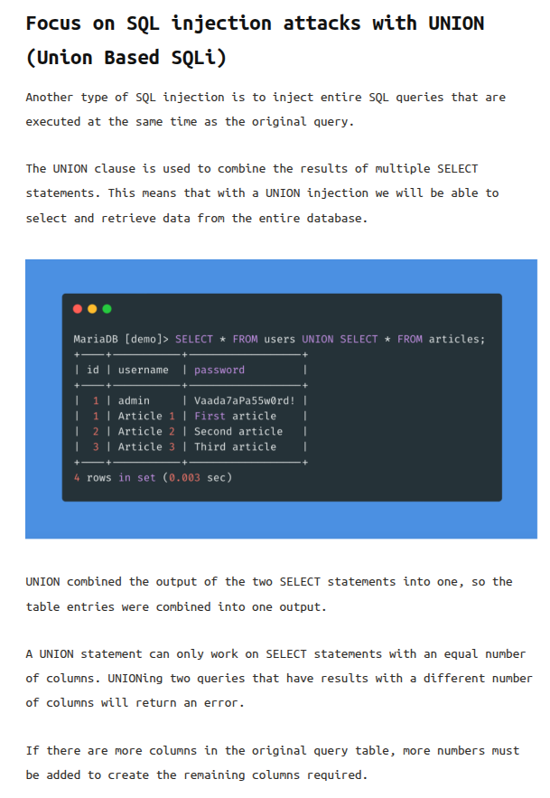
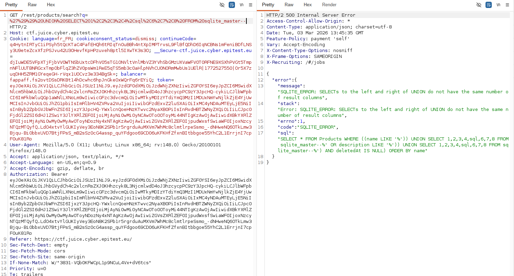
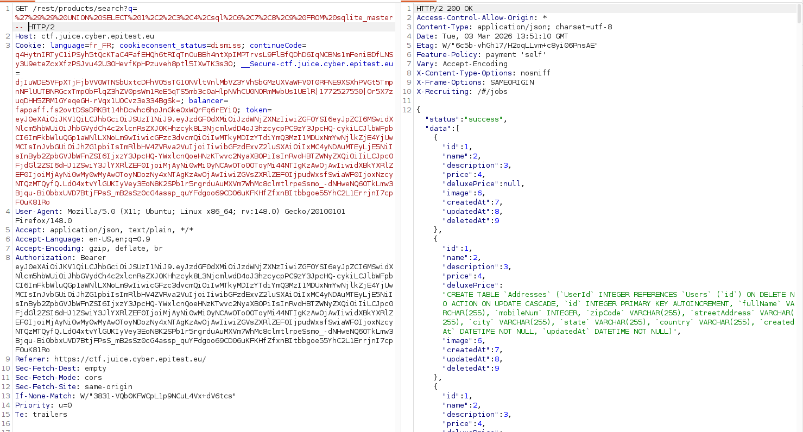

# Rapport de Vulnérabilité

## Vulnérabilité

| Champ                      | Détails                                             |
|----------------------------|-----------------------------------------------------|
| **Type** | Injection SQL (SQLi)                                |
| **Composant affecté** | Fonction de recherche de produits (`/rest/products/search`) |
| **Sévérité** | 🔴 Critique                                         |

---

## Méthodologie

### Techniques utilisées
- [x] Énumération
- [x] Tests manuels
- [x] Autre : requête avec UNION Select

### Outils utilisés
| Outil        | Objectif                              |
|--------------|---------------------------------------|
| Burp Suite   | Interception et modification de la requête HTTP |

### Étapes

1. **Interception** — Capture de la requête de recherche : `GET /rest/products/search?q=`.
2. **Identification de la DB** — Injection des caractères `'))` pour provoquer une erreur. Le message d'erreur confirme l'utilisation de **SQLite**.
3. **Énumération des colonnes** — Tests pour identifier le nombre de colonnes via `UNION SELECT`. Une tentative avec 8 colonnes échoue mais la seconde avec 9 colonnes réussit.
4. **Exfiltration du schéma** — Utilisation de la table système `sqlite_master` pour lister toutes les tables et colonnes de la base de données.

---

### Preuve de concept

**Doucumentation sur UNION :** 
 
**Test de l'injection avec 8 tables :** 
 
**Test (réussi) de l'injection avec 9 tables :** 

## Risques

### Impact
- **Exfiltration totale de données** : Vol d'identifiants, de mots de passe, de produits qui ne sont plus en vente, etc.
- **Accès complet à la base de données** : Lecture de toutes les tables sensibles (utilisateurs, logs, configurations, etc).

---

## Correction

### Correctifs

- **Action 1 : Utiliser des Prepared Statements** : Les paramètres de recherche doivent être liés (bound) et non concaténés directement dans la chaîne SQL.
- **Action 2 : Désactiver les messages d'erreur détaillés** : Les erreurs SQL ne doivent jamais être renvoyées au client pour éviter de donner des indices sur la technologie utilisée.
- **Action 3 : Validation des entrées** : Filtrer ou rejeter les caractères spéciaux comme `'`, `)`, `--` dans les champs de recherche.

### Bonnes pratiques de sécurité recommandées

- Suivre les directives de l'OWASP sur la prévention des injections SQL.
- Appliquer le principe du moindre privilège pour le compte utilisateur accédant à la base de données.
- Utiliser un ORM (Object-Relational Mapping) moderne qui gère nativement la protection contre les injections.