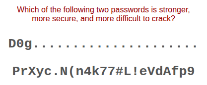
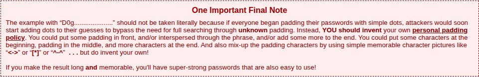

# Rapport de Vulnérabilité

## Vulnérabilité

| Champ                      | Détails                                             |
|----------------------------|-----------------------------------------------------|
| **Type** | Faiblesse d'authentification / Mauvaise pratique / OSINT   |
| **Composant affecté** | Formulaire de connexion (Compte d'Amy)              |
| **Sévérité** | 🟠 Élevée |

---

## Méthodologie

### Techniques utilisées
- [x] OSINT
- [x] Bruteforce
- [x] Tests manuels

### Outils utilisés
| Outil          | Objectif                                             |
|----------------|------------------------------------------------------|
| Navigateur | Accès au login de Juice Shop & Recherche sur la phrase "One Important Final Note"   |
| YouTube    | Identification du lien entre Amy et Kif (Futurama)   |

### Étapes

1. **Recherche contextuelle** — La description mentionne une "Note finale importante" liée au brute-force. Une recherche Google pointe vers la page "Haystack" de GRC.
2. **Analyse de la source** — La page explique qu'un mot de passe très court peut paraître long à bruteforcer s'il est suivi d'une longue suite de caractères identiques (comme des points) que les systèmes de calcul négligent ou traitent spécifiquement.
3. **Identification du profil** — L'utilisateur Amy fait référence à un personnage de Futurama. Dans une vidéo YouTube, lors des premières minutes, on confirme son mariage avec un certain **Kif**.
4. **Exploitation** — Test du mot de passe basé sur le prénom Kif adapté selon l'exemple technique trouvé : `K1f................`.

---

### Preuve de concept

**Cible :** `amy@juice-sh.op`  
**Mot de passe identifié :** `K1f................` (K1f suivi de 16 points) 

**Exemple technique trouvé :** 
 
**La "One Important Final Note" :** 

## Risques

### Impact
- **Account Takeover**.
- **Accès aux informations personnelles**.
- **Usurpation d'identité** sur la plateforme.

---

## Correction

### Correctifs

- **Action 1 : Renforcer la politique de mot de passe** : Interdire les mots de passe basés sur des motifs simples ou des répétitions de caractères prévisibles.
- **Action 2 : Salage et Hashage robuste** : S'assurer que même des mots de passe avec des patterns connus sont stockés de manière à rendre la découverte par dictionnaire impossible.

### Bonnes pratiques de sécurité recommandées
- **Implémenter le MFA (Multi-Factor Authentication)** : Utiliser des seconds facteurs robustes (TOTP, FIDO2) au lieu de secrets basés sur la vie privée.
- Envoyer un jeton de réinitialisation unique par e-mail au lieu de poser une question.
- **Masquage des données en admin** : Ne pas afficher les e-mails complets ou les infos sensibles sur les tableaux de bord publics.