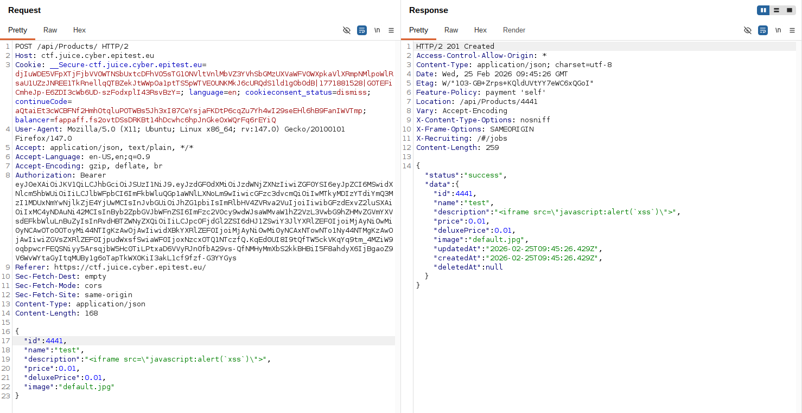

# Rapport de Vulnérabilité

## Vulnérabilité

| Champ                      | Détails                                             |
|----------------------------|-----------------------------------------------------|
| **Type** | Cross-Site Scripting (XSS)                   |
| **Composant affecté** | API de gestion des produits (`/api/products`)       |
| **Sévérité** | 🔴 Critique                                         |

---

## Méthodologie

### Techniques utilisées
- [x] Tests manuels
- [x] Autre : Manipulation de requête API (REST)

### Outils utilisés
| Outil        | Objectif                                                |
|--------------|---------------------------------------------------------|
| Burp Suite   | Interception, modification et répétition de la requête  |

### Étapes

1. **Interception** — Capture d'une requête HTTP avec Burp Suite.
2. **Altération de la cible** — Modification de la méthode en `POST` et de l'URL vers l'endpoint `/api/products`.
3. **Injection du Payload** — Création d'une requête JSON qui permet de créer un nouveau produit. Insertion de la XSS `<iframe src="javascript:alert('xss')">` dans le champ `description`.
4. **Exploitation** — Envoi de la requête. Le serveur répond avec un code `201 Created`, confirmant que le produit malveillant est maintenant stocké en base de données.

---

### Preuve de concept

**Requête malveillante envoyée via Burp Suite :** 

## Risques

### Impact
- **Vol de session** : Récupération des cookies d'authentification ou des jetons JWT des utilisateurs.
- **Détournement de compte** : Possibilité d'effectuer des actions au nom de l'utilisateur victime.
- **Phishing ciblé** : Injection de faux formulaires de connexion pour voler des identifiants.
- **Défaçage** : Modification de l'apparence du site pour nuire à l'image de l'entreprise.

---

## Correction

### Correctifs

- **Action 1 : Input Sanitization** : Filtrer ou supprimer les balises HTML dangereuses (`<iframe>`, `<script>`, etc.) côté serveur avant le stockage en base de données.
- **Action 2 : Output Encoding** : Lors de l'affichage de la description dans l'application, convertir les caractères spéciaux en entités HTML (ex: `<` devient `&lt;`) pour qu'ils soient lus comme du texte et non comme du code.
- **Action 3 : CSP (Content Security Policy)** : Mettre en place une politique CSP stricte pour empêcher l'exécution de scripts inline ou provenant de sources non autorisées.

### Bonnes pratiques de sécurité recommandées

- Appliquer le principe "Don't Trust User Input" sur tous les endpoints de l'API, pas seulement sur l'interface graphique.
- Utiliser des frameworks de rendu (ex: `Angular`) qui gèrent l'encodage des données par défaut.