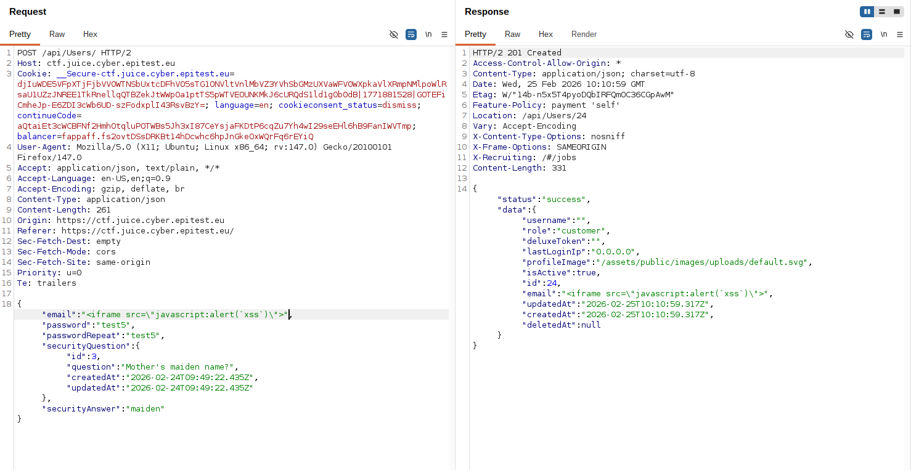

# Rapport de Vulnérabilité

## Vulnérabilité

| Champ                      | Détails                                             |
|----------------------------|-----------------------------------------------------|
| **Type** | Cross-Site Scripting (XSS)                    |
| **Composant affecté** | Inscription utilisateur (`/api/Users/`)             |
| **Sévérité** | 🔴 Critique                                         |

---

## Méthodologie

### Techniques utilisées
- [x] Tests manuels
- [x] Autre : Request Tampering

### Outils utilisés
| Outil        | Objectif                                                |
|--------------|---------------------------------------------------------|
| Burp Suite   | Interception et modification de la requête de création d'un utilisateur |

### Étapes

1. **Interception** — Remplir le formulaire d'inscription sur le site et intercepter la requête `POST /api/Users/` avec Burp Suite.
2. **Modification du Payload** — Remplacer la valeur du champ `"email"` par une XSS comme : `<iframe src="javascript:alert('xss')">`.
3. **Contournement** — Envoyer la requête malveillante. Puisque la validation du format e-mail n'est faite que par le navigateur, le serveur accepte l'injection.
4. **Exécution** — Le script sera exécuté chaque fois qu'un administrateur consultera la liste des utilisateurs ou que l'utilisateur se connectera à son profil.

---

### Preuve de concept

**Requête malveillante envoyée via Burp Suite :** 

## Risques

### Impact
- **Élévation de privilèges** : Si un administrateur affiche la liste des membres, le script peut voler son cookie de session et donner le contrôle total du site à l'attaquant.
- **Vol de données sensibles** : Accès au stockage local et aux informations du navigateur des victimes.

---

## Correction

### Correctifs

- **Action 1 : Validation stricte côté serveur** : Utiliser une Regex robuste côté back-end pour s'assurer que le champ e-mail correspond à un format valide et rejeter tout ce qui contient des balises HTML.
- **Action 2 : Output Escaping** : Lors de l'affichage de l'e-mail dans l'interface (même dans l'administration), transformer les caractères `<` et `>` en entités HTML (`&lt;` et `&gt;`).

### Bonnes pratiques de sécurité recommandées

- Ne jamais se reposer uniquement sur les validations HTML5/JavaScript du navigateur.
- Implémenter une `CSP` (Content Security Policy) interdisant l'exécution de scripts non autorisés.
- Utiliser des Sanitization pour supprimer automatiquement les balises de type `<iframe>` ou `<script>` avant l'insertion en base.