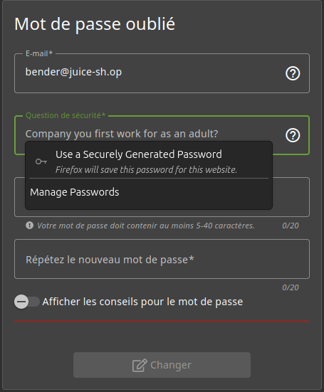
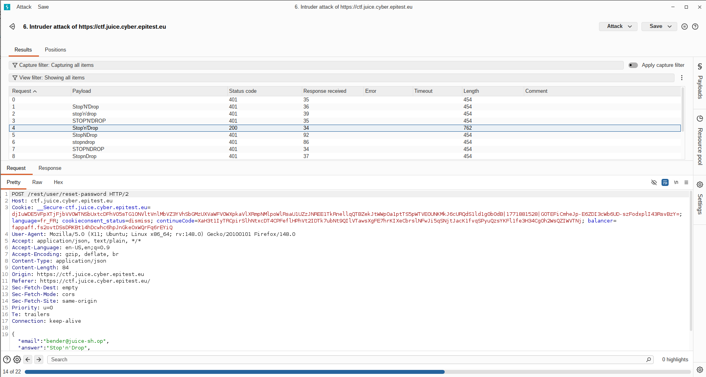

# Rapport de Vulnérabilité

## Vulnérabilité

| Champ                      | Détails                                             |
|----------------------------|-----------------------------------------------------|
| **Type** | OSINT (Open Source Intelligence) / Sniper Attack |
| **Composant affecté** | Système de récupération de compte (Question de sécurité) |
| **Sévérité** | 🟠 Élevée |

---

## Méthodologie

### Techniques utilisées
- [x] OSINT
- [x] Brute-force (Wordlist personnalisée)
- [x] Sniper Attack

### Outils utilisés
| Outil          | Objectif                                             |
|----------------|------------------------------------------------------|
| Navigateur     | Recherche d'informations sur le lore de Futurama |
| Burp Suite     | Sniper Attack sur le champ de réponse |

### Étapes

1. **Identification de la cible** — Tentative de réinitialisation du mot de passe de l'utilisateur `bender@juice-sh.op`. La question posée est : *"Company you first work as an adult?"*.
2. **Recherche OSINT** — Dans le premier épisode de la série, Bender révèle qu'il a été conçu pour tordre des barres de fer destinées aux "suicide booth". Recherche du nom du constructeur de ces cabines : **Stop'n'Drop**.
3. **Préparation de l'attaque** — Création d'une wordlist des différentes manières d'écrirer Stop'N'Drop (ex: `stop'n'drop`, `Stop'n'Drop`, `Stop N Drop`, `stopndrop`).
4. **Sniper Attack** — Utilisation de l'outil *Intruder* de Burp Suite pour tester chaque variante. La requête avec `Stop'n'Drop` renvoie un code HTTP 200, validant la réinitialisation du mot de passe.

---

### Preuve de concept

**Cible :** `bender@juice-sh.op`  
**Question :** *Company you first work as an adult?*  
**Réponse  :** `Stop'n'Drop`

**Question de sécurtité :** 
 
**Sniper Attack sur Stop'N'Drop** 

## Risques

### Impact
- **Account Takeover**.
- **Accès aux informations personnelles**.
- **Usurpation d'identité** sur la plateforme.

---

## Correction

### Correctifs

- **Action 1 : Supprimer les questions de sécurité** : Ce mécanisme est obsolète et vulnérable à l'OSINT.
- **Action 2 : Désactiver le compte compromis** : Réinitialiser immédiatement les accès de l'utilisateur concerné.
- **Action 3 : Lockout** : Bloquer temporairement le formulaire après 3 à 5 tentatives infructueuses pour empêcher le bruteforce.

### Bonnes pratiques de sécurité recommandées

- **Implémenter le MFA (Multi-Factor Authentication)** : Utiliser des seconds facteurs robustes (TOTP, FIDO2) au lieu de secrets basés sur la vie privée.
- Envoyer un jeton de réinitialisation unique par e-mail au lieu de poser une question.
- **Masquage des données** : Ne pas afficher les e-mails complets ou les infos sensibles sur les tableaux de bord publics.