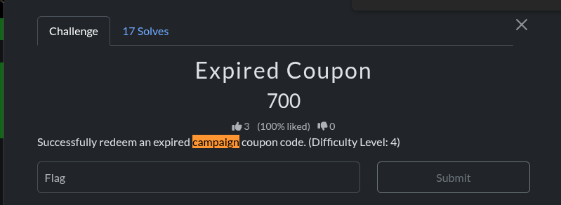
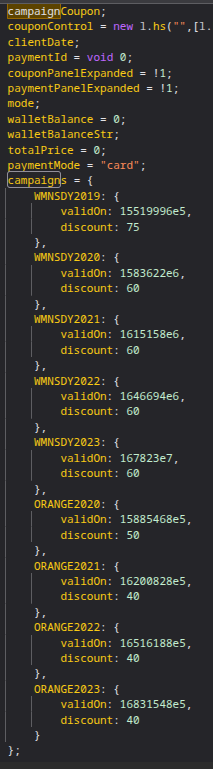
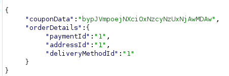
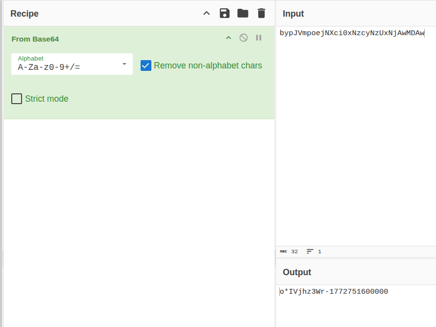
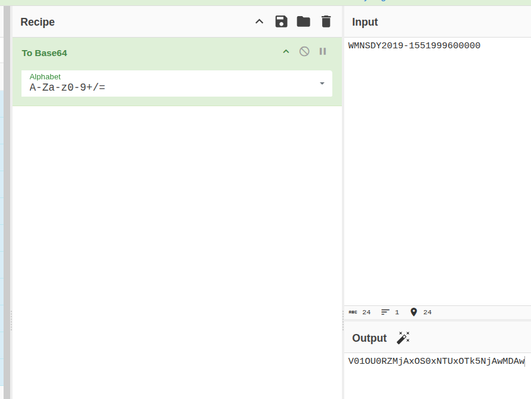
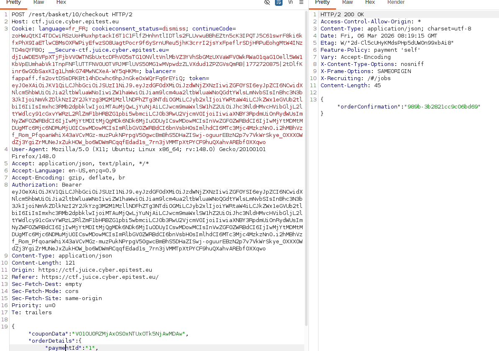

# Rapport de Vulnérabilité

## Vulnérabilité

| Champ                      | Détails                                             |
|----------------------------|-----------------------------------------------------|
| **Type** | Broken Business Logic / Improper Access Control     |
| **Composant affecté** | Système de gestion des promotions (Coupons)         |
| **Sévérité** | 🟡 Moyenne                                          |

---

## Méthodologie

### Techniques utilisées
- [x] Analyse du code source (Front-end)
- [x] Tests manuels
- [x] Autre : Tampering & Base64 Decoding

### Outils utilisés
| Outil          | Objectif                                             |
|----------------|------------------------------------------------------|
| DevTools       | Analyse du fichier `main.js` (Recherche de "campaign")|
| CyberChef      | Encodage et décodage Base64 des payloads             |
| Burp Suite     | Interception et modification de la requête HTTP      |

### Étapes

1. **Recherche de secrets** — Analyse du code source via les DevTools. Identification d'une liste de codes promotionnels obsolètes (`campaign coupons`) directement en dur dans le fichier `main.js`.
2. **Analyse du format** — Utilisation d'un coupon valide pour identifier la méthode de transmission. Le coupon est encodé en **Base64** avant d'être envoyé au serveur.
3. **Tampering** — Utilisation de CyberChef pour encoder l'un des coupons expirés (ex: `WMNSDY2019`) selon le format identifié.
4. **Exploitation de la Business Logic** — Injection du coupon falsifié dans la requête de paiement via Burp Suite. Le serveur valide la réduction malgré la date d'expiration.

---

### Preuve de concept

**Énoncé du challenge :**  

**Liste des coupons trouvée dans le code source :**  

**Coupon valide intercepté :**  

**Décodage du coupon valide sur CyberChef :**  

**Encodage du coupon expiré sur CyberChef :** 

**Requête modifiée avec succès dans Burp Suite :** 

## Risques

### Impact
- **Perte financière** : Application de réductions non autorisées sur les commandes.
- **Manipulation de la logique métier** : Contournement des restrictions temporelles des campagnes marketing.
- **Exploitation de données sensibles** : Accès à des informations de campagne qui devraient être privées.

---

## Correction

### Correctifs

- **Action 1 : Validation côté serveur** : Le backend doit impérativement vérifier la validité (date, statut actif) de chaque coupon en base de données avant de l'appliquer.
- **Action 2 : Nettoyage du code source** : Supprimer toute référence aux codes promotionnels (même expirés) des fichiers JavaScript publics.
- **Action 3 : Integrity Check** : Utiliser des signatures numériques ou des identifiants non prévisibles pour les coupons.

### Bonnes pratiques de sécurité recommandées
- **Default Deny** : Rejeter par défaut tout coupon qui n'est pas explicitement marqué comme actif à l'instant T.
- **Minification et Obfuscation** : Bien que ce ne soit pas une sécurité absolue, cela limite la lecture directe de données sensibles dans le code source.
- **Monitoring** : Journaliser et alerter en cas d'utilisation répétée de codes promotionnels obsolètes.