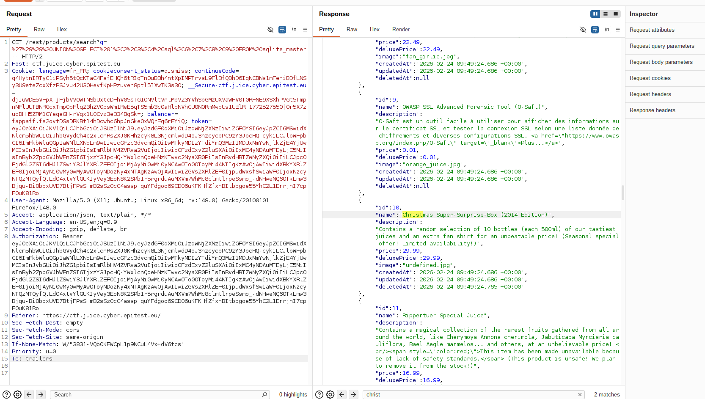
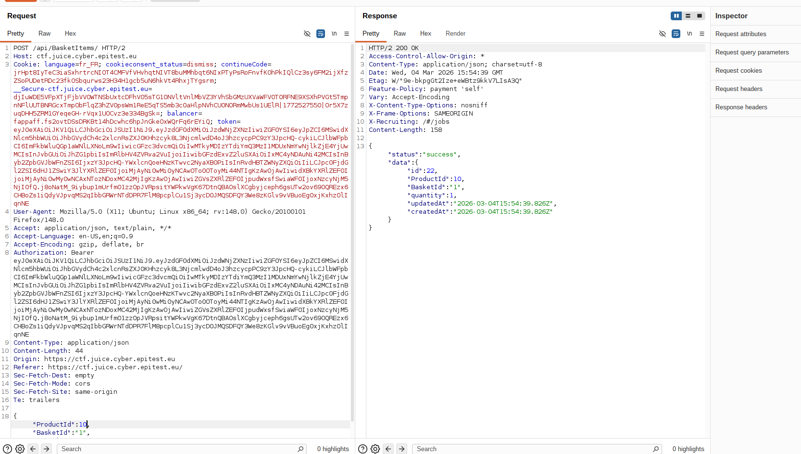

# Rapport de Vulnérabilité

## Vulnérabilité

| Champ                      | Détails                                             |
|----------------------------|-----------------------------------------------------|
| **Type** | IDOR (Insecure Direct Object Reference)             |
| **Composant affecté** | API de gestion du panier (`/api/BasketItems`)       |
| **Sévérité** | 🟠 Élevée                                           |

---

## Méthodologie

### Techniques utilisées
- [x] Énumération de base de données (via SQLi)
- [x] Tests manuels
- [x] Autre : Parameter Tampering

### Outils utilisés
| Outil        | Objectif                                                |
|--------------|---------------------------------------------------------|
| Burp Suite   | Interception et modification du `ProductId`             |
| Navigateur   | Visualisation du panier et validation de la commande    |

### Étapes

1. **Recherche d'information** — Utilisation des données extraites lors de l'exploitation du "Database Schema" pour identifier l'existence d'un produit non listé publiquement avec l'ID `10`.
2. **Interception** — Ajout d'un article standard au panier et interception de la requête `POST /api/BasketItems/` via Burp Suite.
3. **Parameter Tampering** — Modification de la valeur du paramètre `ProductId` par `10` directement dans le corps de la requête JSON interceptée.
4. **Exploitation de l'IDOR** — Envoi de la requête modifiée. Le serveur valide l'ajout du produit "Christmas Special" au panier malgré son absence de l'interface Front-end.

---

### Preuve de concept

**Identification de l'ID produit en base de données :** 

**Modification de l'ID dans le panier via Burp Suite :** 

## Risques

### Impact
- **Accès à des produits restreints** : Capacité d'acheter des articles non publiés, cachés ou en édition limitée.
- **Contournement de la logique commerciale** : Accès prématuré à des offres saisonnières ou promotionnelles.
- **Information Disclosure** : Fuite d'informations sur le catalogue produit non public.

---

## Correction

### Correctifs

- **Action 1 : Server-Side Access Control** : Le Backend doit vérifier systématiquement si le produit demandé est marqué comme "actif" et "disponible à la vente" avant l'insertion dans le panier.
- **Action 2 : Utilisation d'identifiants non-prévisibles** : Remplacer les ID incrémentaux par des UUID (Universally Unique Identifiers) pour empêcher l'énumération par l'attaquant.
- **Action 3 : Validation de l'intégrité** : Re-vérifier la légitimité de l'objet au moment du Checkout.

### Bonnes pratiques de sécurité recommandées

- **Zero Trust Input** : Ne jamais considérer une donnée provenant du client (ID, prix, quantité) comme valide sans vérification côté serveur.
- Implémenter des tests d'autorisation automatisés sur tous les endpoints manipulant des ressources par ID.
- Effectuer des audits réguliers pour s'assurer que les objets désactivés en base de données ne sont plus accessibles via l'API.