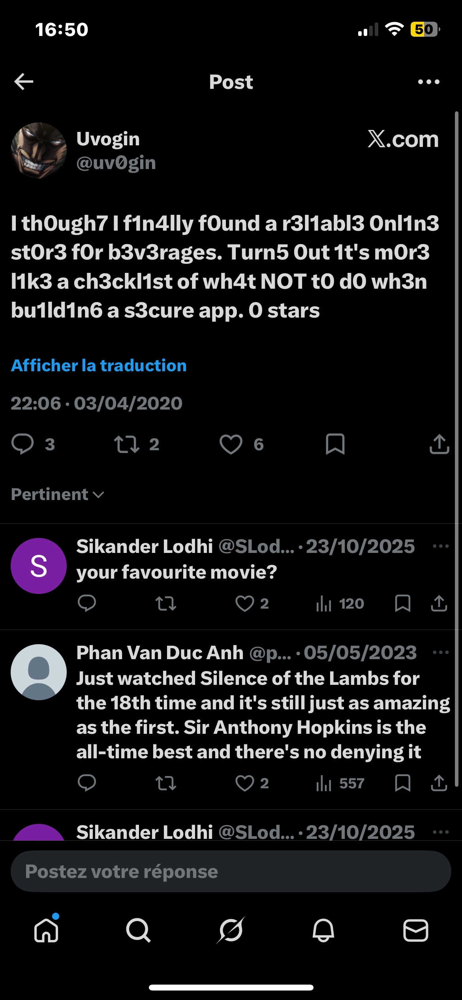

# Rapport de Vulnérabilité

## Vulnérabilité

| Champ                      | Détails                                             |
|----------------------------|-----------------------------------------------------|
| **Type** | OSINT (Open Source Intelligence)                    |
| **Composant affecté** | Système de récupération de compte (Question de sécurité) |
| **Sévérité** | 🟠 Élevée                                           |

---

## Méthodologie

### Techniques utilisées
- [x] OSINT
- [x] Autre : Analyse de réseaux sociaux (X / Twitter)

### Outils utilisés
| Outil          | Objectif                                             |
|----------------|------------------------------------------------------|
| Navigateur     | Recherche des profils sociaux de la cible            |
| Twitter (X)    | Analyse des interactions publiques et des réponses    |

### Étapes

1. **Identification de la cible** — Tentative de réinitialisation du mot de passe pour l'utilisateur `uvogin@juice-sh.op`. La question posée est : *"Your favorite movie?"*.
2. **Pivot OSINT** — Recherche de "uvogin social media" sur un moteur de recherche. Identification d'un compte Twitter (@uv0gin) dont la bio mentionne "now I smash firewalls".
3. **Analyse des interactions** — Analyse des réponses sous l'unique tweet du compte. Identification d'un échange confirmant que son film préféré est "Silence of the Lambs".
4. **Account Takeover** — Saisie de la réponse `Silence of the Lambs` dans le formulaire de récupération de compte du site pour valider le changement de mot de passe.

---

### Preuve de concept

**Recherche du compte social de la cible :** 

**Identification de la réponse dans les interactions Twitter :** 

## Risques

### Impact
- **Account Takeover**.
- **Accès aux informations personnelles**.
- **Usurpation d'identité** au sein de l'application.

---

## Correction

### Correctifs

- **Action 1 : Supprimer les questions de sécurité** : Ce mécanisme est obsolète et vulnérable à l'OSINT.
- **Action 2 : Désactiver le compte compromis** : Réinitialiser immédiatement les accès de l'utilisateur concerné.
- **Action 3 : Lockout** : Bloquer temporairement le formulaire après 3 à 5 tentatives infructueuses pour empêcher le bruteforce.

### Bonnes pratiques de sécurité recommandées

- **Implémenter le MFA (Multi-Factor Authentication)** : Utiliser des seconds facteurs robustes (TOTP, FIDO2) au lieu de secrets basés sur la vie privée.
- Envoyer un jeton de réinitialisation unique par e-mail au lieu de poser une question.
- **Masquage des données** : Ne pas afficher les e-mails complets ou les infos sensibles sur les tableaux de bord publics.