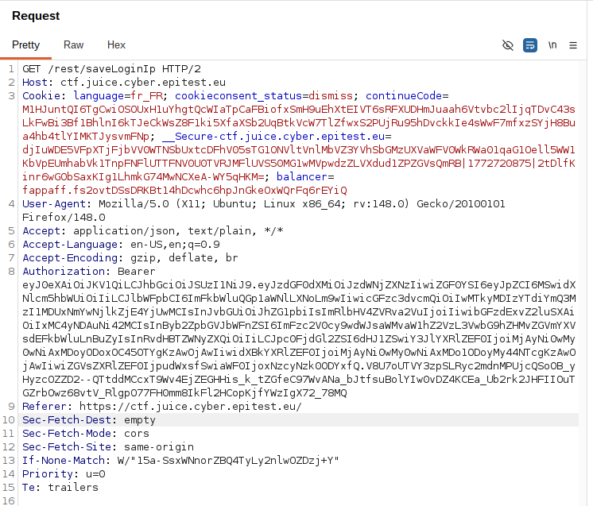
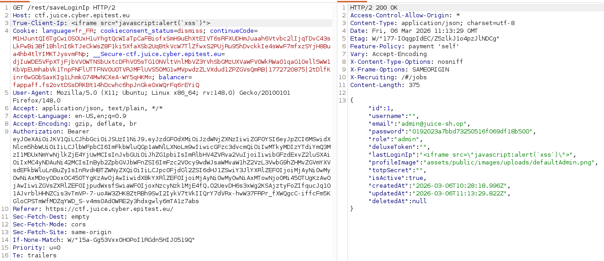

# Rapport de Vulnérabilité

## Vulnérabilité

| Champ                      | Détails                                             |
|----------------------------|-----------------------------------------------------|
| **Type** | Stored XSS (via HTTP Header Injection)              |
| **Composant affecté** | Endpoint de logging (`/rest/user/saveLoginIp`)      |
| **Sévérité** | 🔴 Critique                                         |

---

## Méthodologie

### Techniques utilisées
- [x] Header Tampering
- [x] Stored XSS
- [x] Tests manuels

### Outils utilisés
| Outil        | Objectif                                                |
|--------------|---------------------------------------------------------|
| Burp Suite   | Interception et injection d'en-têtes HTTP personnalisés |
| Navigateur   | Observation du déclenchement lors de la consultation du profil |

### Étapes

1. **Analyse du flux de login** — Observation de la requête `POST /rest/user/saveLoginIp` générée lors des phases de déconnexion.
2. **Identification du vecteur d'injection** — Hypothèse selon laquelle le backend récupère l'adresse IP via des en-têtes de type Proxy ou CDN pour ses logs.
3. **Header Tampering** — Injection de l'en-tête `True-Client-IP` contenant un Payload XSS : `<iframe src="javascript:alert('xss')">` au lieu d'une adresse IP standard.
4. **Persistance et exécution** — Le serveur enregistre la valeur malveillante en base de données comme étant la "Last Login IP". Le script s'exécute dès que cette information est affichée dans l'interface utilisateur.

---

### Preuve de concept

**Requête de logging initiale :** 

**Injection du Payload via l'en-tête True-Client-IP dans Burp Suite :** 

## Risques

### Impact
- **Session Hijacking** : Vol des cookies de session et des jetons JWT.
- **Account Takeover** : Capacité à effectuer des actions au nom de l'utilisateur victime.
- **Log Poisoning** : Falsification des journaux d'audit pour masquer des activités malveillantes.

---

## Correction

### Correctifs

- **Action 1 : IP Validation** : Le backend doit valider strictement que les valeurs extraites des en-têtes (X-Forwarded-For, True-Client-IP) respectent le format IPv4 ou IPv6. Toute valeur non conforme doit être rejetée.
- **Action 2 : Output Encoding** : Appliquer un encodage des entités HTML lors de l'affichage de l'adresse IP dans le Front-end.
- **Action 3 : Content Security Policy (CSP)** : Implémenter une politique CSP restrictive pour bloquer l'exécution de scripts non autorisés.

### Bonnes pratiques de sécurité recommandées

- **Zero Trust Headers** : Ne jamais considérer les en-têtes HTTP (souvent falsifiables) comme des sources de données sûres.
- Utiliser des bibliothèques de validation d'IP standardisées côté serveur.
- Restreindre l'acceptation de ces en-têtes aux seules adresses IP provenant de proxies de confiance connus.