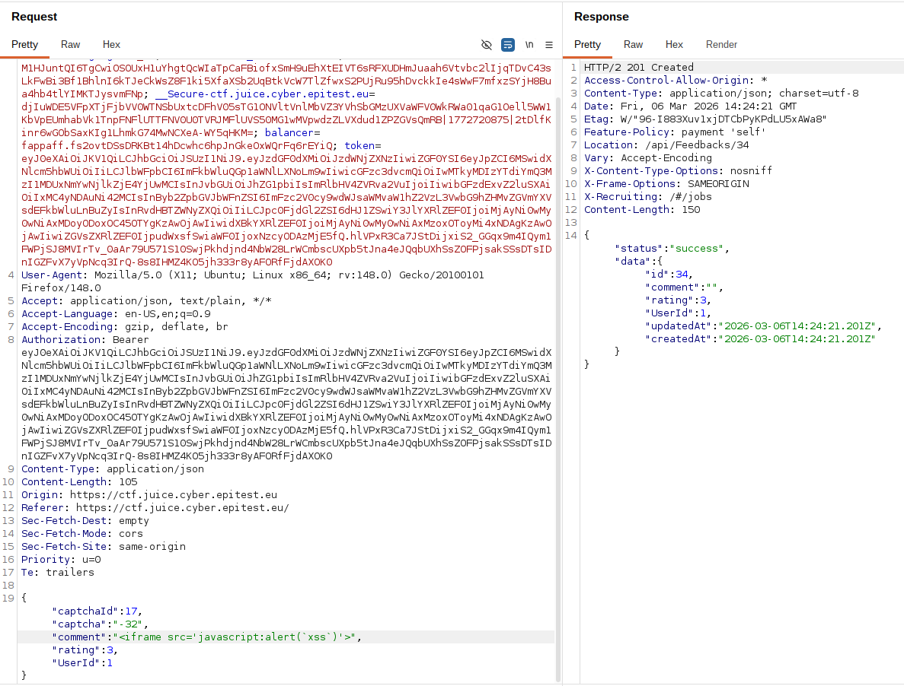
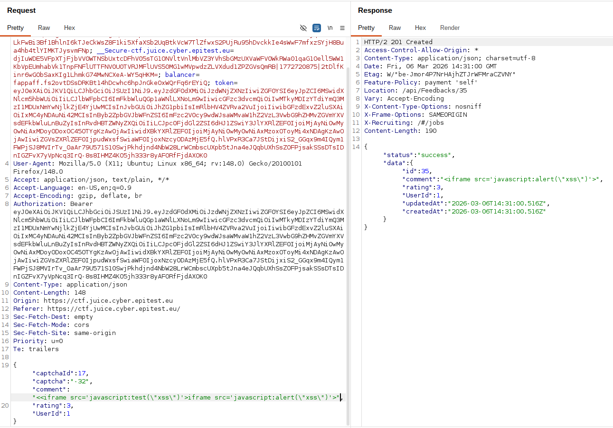
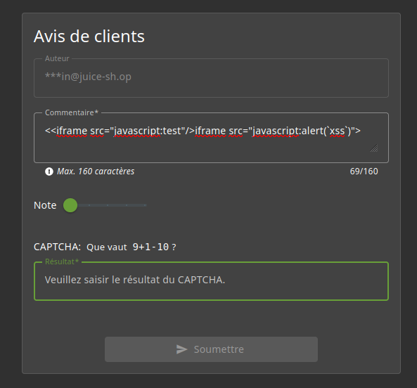

# Rapport de Vulnérabilité

## Vulnérabilité

| Champ                      | Détails                                             |
|----------------------------|-----------------------------------------------------|
| **Type** | Stored XSS (Recursive Filter Bypass)                |
| **Composant affecté** | Système d'avis clients (Customer Feedback)          |
| **Sévérité** | 🔴 Critique                                         |

---

## Méthodologie

### Techniques utilisées
- [x] Payload Doubling
- [x] Stored XSS
- [x] Tests manuels

### Outils utilisés
| Outil        | Objectif                                                |
|--------------|---------------------------------------------------------|
| Burp Suite   | Analyse comportementale du filtrage Backend             |
| Navigateur   | Injection directe via le champ "Commentaire"            |

### Étapes

1. **Analyse du filtrage** — Test d'injection d'un Payload standard : `<iframe src="javascript:alert('xss')">`. Le serveur identifie la balise et procède à sa suppression.
2. **Identification de la logique de filtrage** — Découverte que le mécanisme de défense n'est pas récursif (il ne scanne la chaîne qu'une seule fois).
3. **Construction du Payload** — Création d'une charge utile "doublée" utilisant la récursion : `<<iframe src="javascript:test"/>iframe src="javascript:alert('xss')">`.
4. **Bypass et Injection** — Saisie du Payload dans le champ "Commentaire". Le Backend supprime la première occurrence d'`<iframe`, ce qui a pour effet de reconstituer une balise valide avant le stockage en base de données.

---

### Preuve de concept

**Tentative d'injection filtrée par le serveur :** 

**Payload doublé non détecté par le filtre :** 

**Exécution du script XSS dans la section avis :** 

## Risques

### Impact
- **Session Hijacking** : Vol des cookies de session des utilisateurs et administrateurs.
- **Malware Distribution** : Redirection forcée vers des domaines malveillants.
- **Phishing** : Injection de faux formulaires de login pour capturer des credentials.
- **Déni de Service (DoS)** : Injection de scripts provoquant le crash du navigateur client.

---

## Correction

### Correctifs

- **Action 1 : Bannir les Blacklists** : Ne jamais tenter de "nettoyer" une entrée en supprimant des mots-clés. Ce mécanisme est structurellement contournable par récursion ou encodage.
- **Action 2 : Input Sanitization (Whitelist)** : Utiliser une bibliothèque de sanitization robuste (ex: DOMPurify) qui traite le contenu de manière récursive et n'autorise que les balises sûres.
- **Action 3 : Output Encoding** : Appliquer systématiquement un encodage des entités HTML (`&lt;`, `&gt;`) lors de l'affichage des données utilisateurs.

### Bonnes pratiques de sécurité recommandées

- **Content Security Policy (CSP)** : Implémenter une CSP stricte interdisant l'exécution de scripts inline et de `javascript:` URIs.
- **Security Regression Testing** : Effectuer des tests de pénétration réguliers sur les filtres de sécurité pour identifier les bypass potentiels.
- **Frontend Framework Security** : Utiliser les mécanismes d'auto-escaping des frameworks modernes (React, Angular) au lieu de manipuler directement le DOM.