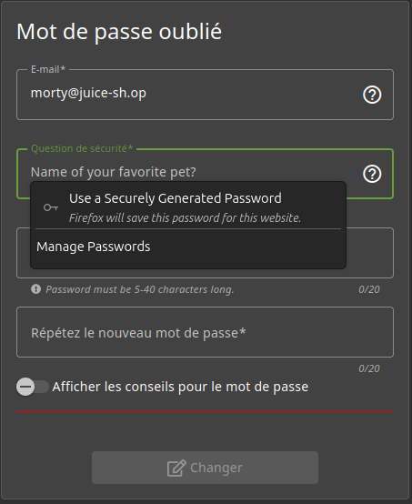
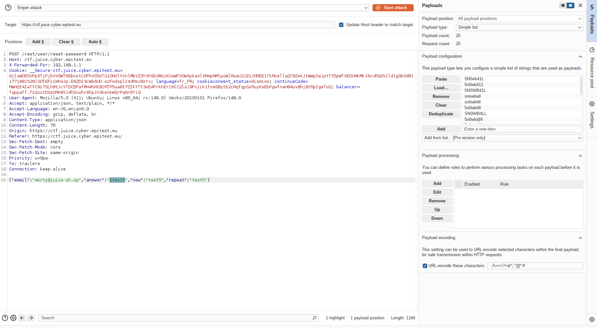
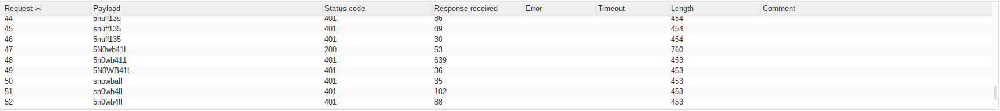

# Rapport de Vulnérabilité

## Vulnérabilité

| Champ                      | Détails                                             |
|----------------------------|-----------------------------------------------------|
| **Type** | OSINT (Open Source Intelligence) / Leet Speak Brute-force |
| **Composant affecté** | Système de récupération de compte (Question de sécurité) |
| **Sévérité** | 🟠 Élevée                                           |

---

## Méthodologie

### Techniques utilisées
- [x] OSINT
- [x] Sniper Attack
- [x] Autre : Analyse de patterns Leet Speak (Obfuscation)

### Outils utilisés
| Outil          | Objectif                                             |
|----------------|------------------------------------------------------|
| Navigateur     | Recherche d'informations sur le lore de Rick & Morty |
| Burp Suite     | Sniper Attack sur le champ de réponse (Intruder)     |
| Wordlist Gen   | Création de variantes obfusquées (Leet Speak)        |

### Étapes

1. **Identification de la cible** — Tentative de réinitialisation pour `morty@juice-sh.op`. Question posée : *"Name of your favorite pet?"*.
2. **Recherche OSINT** — Analyse de la saison 1 épisode 2 de Rick & Morty. Identification du chien de Morty : `Snuffles`, renommé par la suite en `Snowball`.
3. **Analyse de l'indice** — La description du challenge mentionne une "obfuscated answer". Hypothèse d'une réponse basée sur le mot `Snowball` transformé en **Leet Speak**.
4. **Sniper Attack** — Création d'une wordlist personnalisée avec différentes variantes d'obfuscation (ex: `Sn0wb4ll`, `5N0wb41L`). Lancement de l'attaque via Burp Suite Intruder. La variante `5N0wb41L` valide l'accès.

---

### Preuve de concept

**Question de sécurité pour l'utilisateur Morty :** 

**Configuration de la Sniper Attack dans Burp Suite :** 

**Payload valide identifié (HTTP 200 OK) :** 

## Risques

### Impact
- **Account Takeover**.
- **Accès aux informations personnelles**.
- **Démonstration de l'inefficacité de l'obfuscation** : Le Leet Speak ne protège pas contre des attaques automatisées ciblées.

---

## Correction

### Correctifs

- **Action 1 : Supprimer les questions de sécurité** : Ce mécanisme est obsolète et vulnérable à l'OSINT, même avec une couche d'obfuscation simple.
- **Action 2 : Implémenter le Password Reset par Token** : Envoyer un lien de réinitialisation unique et temporaire par e-mail.
- **Action 3 : Lockout** : Bloquer temporairement le formulaire après plusieurs tentatives infructueuses (Rate Limiting).

### Bonnes pratiques de sécurité recommandées

- **Implémenter le MFA (Multi-Factor Authentication)** : Utiliser des seconds facteurs robustes (TOTP, FIDO2).
- **Hachage des secrets** : Si les questions sont maintenues, traiter la réponse comme un mot de passe (hachage avec salt).
- Ne jamais baser la sécurité sur des faits de notoriété publique ou des éléments de culture populaire.