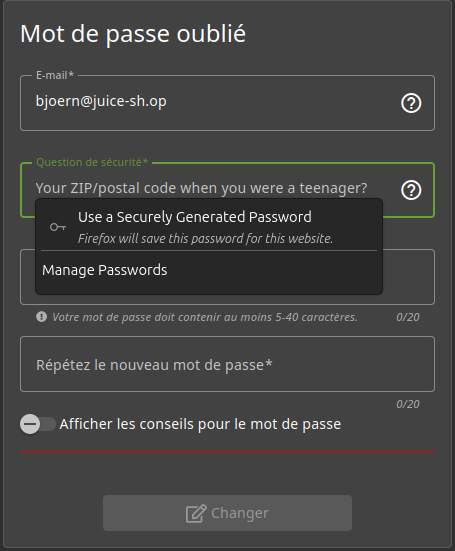
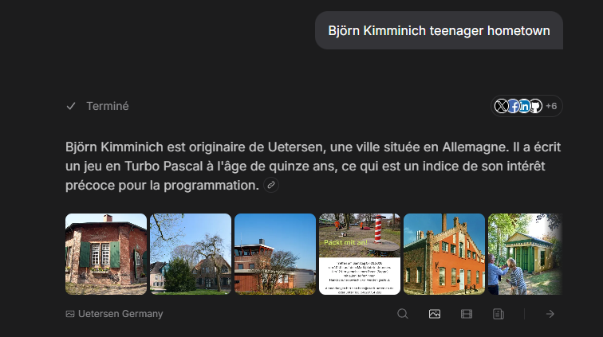
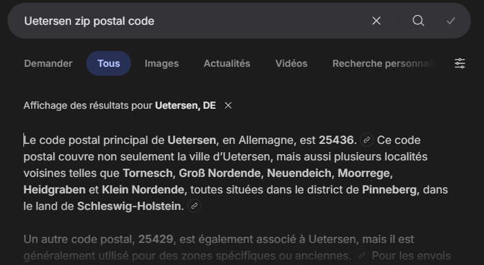
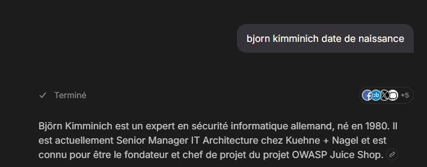
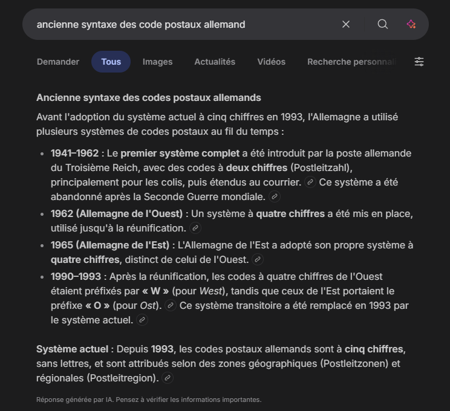
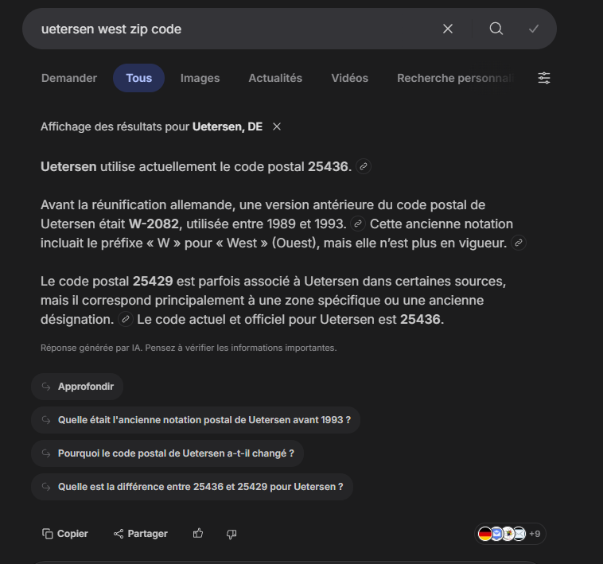

# Rapport de Vulnérabilité

## Vulnérabilité

| Champ                      | Détails                                             |
|----------------------------|-----------------------------------------------------|
| **Type** | OSINT (Open Source Intelligence)         |
| **Composant affecté** | Système de récupération de compte (Question de sécurité) |
| **Sévérité** | 🟠 Élevée                                           |

---

## Méthodologie

### Techniques utilisées
- [x] OSINT (Recherche biographique et historique)
- [x] Tests manuels

### Outils utilisés
| Outil          | Objectif                                             |
|----------------|------------------------------------------------------|
| Navigateur     | Recherche de PII (Personally Identifiable Information)|
| Moteur de recherche | Investigation sur l'évolution des codes postaux (PLZ)|

### Étapes

1. **Identification de la cible** — Recherche sur Björn Kimminich pour identifier son lieu de résidence durant son adolescence : Uetersen, Allemagne.
2. **Échec des données actuelles** — Tentative avec les codes postaux actuels d'Uetersen (`25436`, `25429`). Ces derniers sont rejetés par le Backend.
3. **Analyse temporelle** — Vérification de la date de naissance de la cible (1980). Calcul de la période de son adolescence (début des années 90).
4. **Investigation historique** — Recherche sur la réforme des codes postaux en Allemagne (Postleitzahl). Avant 1993, les codes comportaient 4 chiffres et utilisaient le préfixe "W-" (West) après la réunification.
5. **Account Takeover** — Identification de l'ancien code postal d'Uetersen (`2082`). Combinaison avec la syntaxe historique pour obtenir la réponse : `West-2082`.

---

### Preuve de concept

**Question de sécurité (ZIP/postal code) :** 

**Identification du lieu d'origine via OSINT :** 

**Zip code de Uetersen :** 

**Vérification de la date de naissance pour le contexte historique :** 

**Analyse de la syntaxe des anciens codes postaux allemands :** 

**Validation du secret et réinitialisation réussie :** 

## Risques

### Impact
- **Account Takeover** (Compte Administrateur).
- **Accès aux informations personnelles**.
- **Information Disclosure** : Fuite de données sensibles sur l'infrastructure via les privilèges admin.

---

## Correction

### Correctifs

- **Action 1 : Supprimer les questions de sécurité** : Ce mécanisme est obsolète et vulnérable à l'OSINT.
- **Action 2 : Désactiver le compte compromis** : Réinitialiser immédiatement les accès de l'utilisateur concerné.
- **Action 3 : Lockout** : Bloquer temporairement le formulaire après 3 à 5 tentatives infructueuses pour empêcher le bruteforce.

### Bonnes pratiques de sécurité recommandées

- **Implémenter le MFA (Multi-Factor Authentication)** : Utiliser des seconds facteurs robustes (TOTP, FIDO2) au lieu de secrets basés sur la vie privée.
- Envoyer un jeton de réinitialisation unique par e-mail au lieu de poser une question.
- **Masquage des données** : Ne pas afficher les e-mails complets ou les infos sensibles sur les tableaux de bord publics.