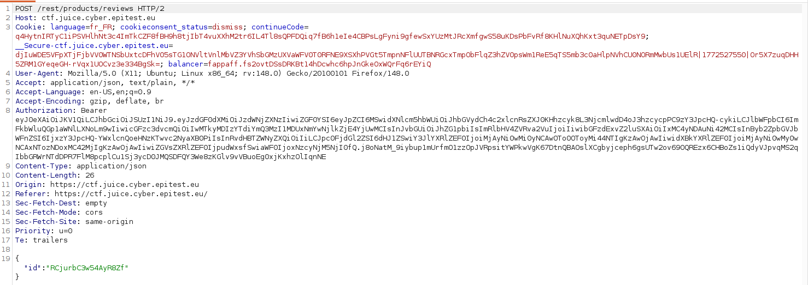
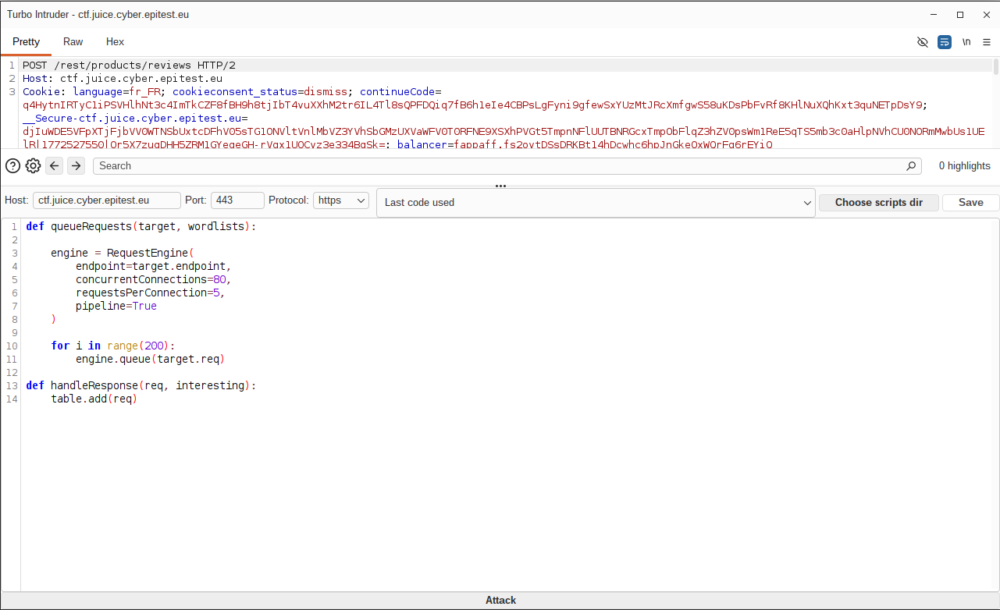
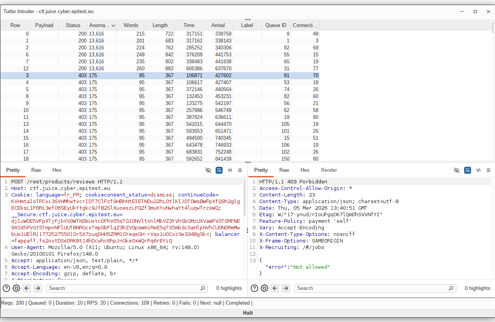

# Rapport de Vulnérabilité

## Vulnérabilité

| Champ                      | Détails                                             |
|----------------------------|-----------------------------------------------------|
| **Type** | Race Condition           |
| **Composant affecté** | Système d'évaluation des produits (`/rest/products/review`) |
| **Sévérité** | 🟡 Moyenne                                          |

---

## Méthodologie

### Techniques utilisées
- [x] Tests manuels
- [x] Autre : Attaque par concurrence (Parallel Request Attack)

### Outils utilisés
| Outil          | Objectif                                             |
|----------------|------------------------------------------------------|
| Burp Suite     | Interception de la requête de Like                   |
| Turbo Intruder | Envoi massif et simultané de requêtes HTTP           |

### Étapes

1. **Identification du mécanisme** — Observation du comportement standard : un utilisateur ne peut normalement liker une review qu'une seule fois.
2. **Test de répétition simple** — Tentative d'envoi séquentiel via le *Repeater*. Le serveur bloque les requêtes suivantes avec une erreur.
3. **Préparation de l'attaque** — Utilisation de l'extension *Turbo Intruder* pour contourner le traitement séquentiel. Configuration d'un script pour envoyer des requêtes en parallèle sur plusieurs connexions simultanées.
4. **Exploitation** — Envoi de 200 requêtes réparties sur 80 connexions. Le "timing window" permet de valider 6 likes avant que le système n'ait le temps de mettre à jour le statut de l'utilisateur et de bloquer les autres requêtes.

---

### Preuve de concept

**Requête POST interceptée d'une review :** 

**Configuration du script dans Turbo Intruder :** 

**Résultats de l'attaque avec plusieurs codes HTTP 200 OK :** 

## Risques

### Impact
- **Manipulation de la réputation** : Gonfler artificiellement la popularité d'un produit ou d'un avis.
- **Détournement de logique métier** : Sur d'autres fonctionnalités, cela pourrait permettre de retirer de l'argent deux fois, d'utiliser plusieurs fois un coupon à usage unique ou de voter plusieurs fois.
- **Instabilité des données** : Risque de corruption de la base de données si les écritures concurrentes ne sont pas gérées.

---

## Correction

### Correctifs

- **Action 1 : Utilisation de verrous de base de données (Database Locking)** : Implémenter un verrouillage optimiste ou pessimiste au niveau de la ligne de base de données pour empêcher toute lecture/écriture concurrente sur le même objet durant la transaction.
- **Action 2 : Contraintes d'unicité (Unique Constraints)** : Ajouter une contrainte d'unicité composée (ex: `user_id` + `review_id`) dans la base de données pour garantir qu'un doublon est rejeté au niveau physique, peu importe la vitesse des requêtes.

### Bonnes pratiques de sécurité recommandées
- Centraliser la logique de validation et d'écriture dans une transaction atomique.
- Limiter le nombre de requêtes par seconde par utilisateur (Rate Limiting) pour réduire la fenêtre d'opportunité d'une attaque par concurrence.
- Effectuer des tests de charge et de concurrence lors des audits de sécurité pour identifier les fonctions sensibles au "timing".