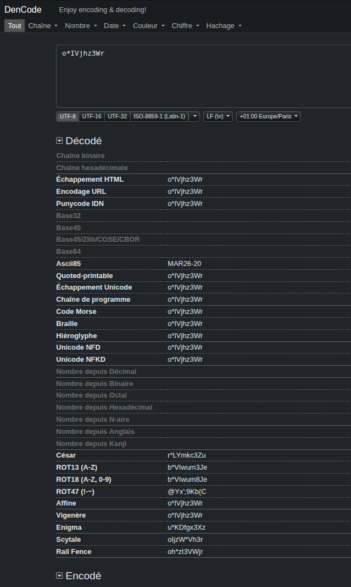
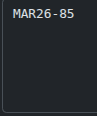
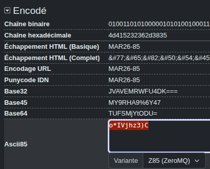

# Rapport de Vulnérabilité

## Vulnérabilité

| Champ                      | Détails                                             |
|----------------------------|-----------------------------------------------------|
| **Type** | Broken Business Logic / Token Forgery               |
| **Composant affecté** | Système de validation des coupons promotionnels     |
| **Sévérité** | 🟠 Élevée                                           |

---

## Méthodologie

### Techniques utilisées
- [x] Reverse Engineering (Analyse d'encodage)
- [x] Token Forgery
- [x] Tests manuels

### Outils utilisés
| Outil          | Objectif                                             |
|----------------|------------------------------------------------------|
| Dencode.com    | Identification, décodage et ré-encodage en ASCII85    |
| Navigateur     | Test d'injection du coupon falsifié dans le Checkout |

### Étapes

1. **Identification de l'encodage** — Analyse d'un coupon promotionnel valide (ex: Mars à 20%). Test de différents schémas de décodage pour identifier la structure du secret.
2. **Reverse Engineering (ASCII85)** — Identification via l'outil "Dencode" que le coupon utilise l'encodage **ASCII85**. Le décodage révèle une chaîne en clair (ex: `MAR26-20`).
3. **Token Forgery** — Manipulation de la valeur déchiffrée directement dans l'outil pour augmenter arbitrairement le pourcentage de réduction (remplacement de `20` par `85`).
4. **Validation du coupon falsifié** — Ré-encodage de la nouvelle chaîne `MAR26-85` en ASCII85. Injection du résultat dans le champ coupon du panier d'achat. Le serveur valide la réduction de 85%, confirmant l'absence de vérification d'intégrité.

---

### Preuve de concept

**Décodage du coupon original (20%) via Dencode :** 

**Modification de la valeur en clair pour forger le nouveau coupon (85%) :** 

**Ré-encodage du Payload malveillant en ASCII85 :** 

## Risques

### Impact
- **Perte financière directe** : Capacité pour un attaquant de définir son propre prix lors de la transaction.
- **Manipulation de la Business Logic** : Création de coupons promotionnels non existants ou non autorisés en base de données.
- **Rupture de confiance** : La sécurité du système repose sur un simple encodage réversible (Obfuscation) plutôt que sur un chiffrement ou une signature.

---

## Correction

### Correctifs

- **Action 1 : Database-backed Validation** : Le serveur ne doit jamais traiter la valeur de réduction contenue dans le coupon. Le coupon doit servir de clé (ID) pour récupérer le taux de réduction réel stocké dans une base de données sécurisée.
- **Action 2 : Integrity Check (HMAC)** : Implémenter une signature cryptographique (Hash-based Message Authentication Code) sur le coupon. Le serveur rejette tout coupon dont la signature ne correspond pas au contenu, empêchant toute modification par le client.
- **Action 3 : Cryptographically Secure Identifiers** : Utiliser des codes coupons aléatoires et non prévisibles au lieu de formats basés sur des dates ou des noms de mois.

### Bonnes pratiques de sécurité recommandées
- **Encoding is not Encryption** : Ne jamais utiliser d'encodages (Base64, ASCII85, Hex) comme mesure de protection pour des données sensibles.
- Ne jamais stocker de variables critiques (prix, remises, rôles) dans des objets manipulables côté Front-end sans signature d'intégrité.
- Monitorer l'utilisation anormale de codes coupons à fort pourcentage pour détecter les tentatives de fraude.